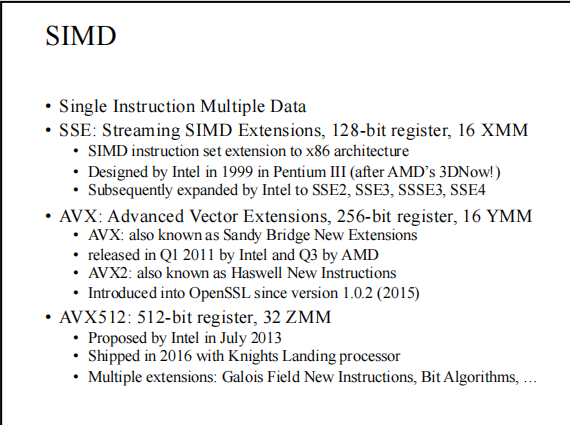
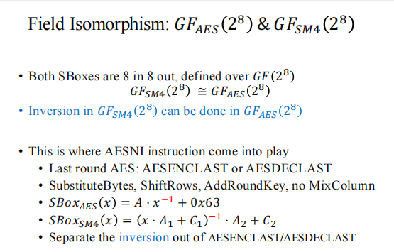
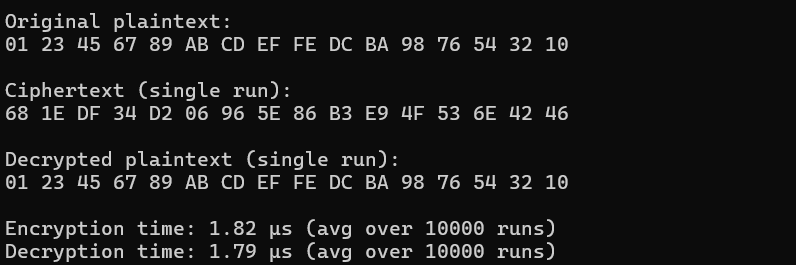

**SM4 软件实现 — 最终版**

## 概述

本项目为 SM4 分组密码算法的 **软件实现**，旨在完成算法的端到端加解密功能并进行性能测试。本版本为第1版（Baseline），目的是实现基础的加解密功能并在此基础上进行优化。


## 运行环境

* **操作系统**：Windows 11 (64-bit)
* **编译器**：Visual Studio 2022
* **处理器**：11th Gen Intel(R) Core™ i7-11800H @ 2.30GHz  
* **内存**：16.0 GB (15.7 GB 可用)  
* **系统类型**：64 位操作系统，基于 x64 的处理器  
## 优化总结

本项目对 SM4 实现进行了多层次优化，提升了加解密性能，具体优化点如下：

- ✅ 使用宏展开替代轮函数循环，减少分支开销；
- ✅ 密钥扩展过程完全展开，避免循环结构；
- ✅ 采用 SSE/AVX 指令实现异或与移位并行计算；
- ✅ 利用 `_mm_shuffle_epi8` 进行字节重排操作；
- ✅ 使用 AES-NI 的 `_mm_aesenclast_si128` 实现 SBox 替换，避免传统查表操作；
- ✅ 结合 AES 前后置矩阵变换与 SM4 专用矩阵混合线性变换；
- ✅ 使用 `_mm_loadu_si128` / `_mm_storeu_si128` 加快内存读取；
- ✅ 数据结构按128位对齐，减少内存对齐惩罚；
- ✅ 使用固定 CK/FK 常量避免重复初始化；
- ✅ 性能测试中进行预热，消除首次调用偏差；
- ✅ 编译器开启优化（如 `-O3`）以配合 SIMD 加速；
- ✅ 放弃传统 T 表查找，避免缓存污染与分支预测失败，提高现代 CPU 上的执行效率；


## ✨ 优化点详解

本实现融合了多种软件层面的高级优化技术，提升了运行速度和并行处理能力：

### ✅ 1. SIMD 并行优化（SSE 向量指令）

利用 `__m128i` 向量类型进行并行数据处理，实现异或、移位、S盒、线性变换等操作的向量化。


**关键代码：**
```cpp
#define VEC_XOR6(a, b, c, d, e, f) _mm_xor_si128(a, VEC_XOR5(b, c, d, e, f))
#define VEC_ROTATE(vec, n) _mm_xor_si128(_mm_slli_epi32(vec, n), _mm_srli_epi32(vec, 32 - (n)))
```

---

### ✅ 2. AES-NI 加速 SBox 变换

在本项目中，我们并未采用传统的 T 表查找方式（预计算 SBox 和线性变换表），而是借助了 **AES-NI 指令的非线性变换能力**，通过 `_mm_aesenclast_si128` 指令间接实现了高性能的 SBox 替换。这种方式**性能更优、并行度更强、安全性更高**，适合现代 x86 平台的高级优化。

**二者不可共存**

由于 AES-NI 是在硬件层直接完成加密轮操作的，不再需要查表操作；而 T 表则完全依赖内存查表实现非线性和线性操作，**这两种优化本质上是互斥的**，不能同时应用。如果混合使用，不仅失去优化效果，还会增加实现复杂度与出错风险。所以基于效率和安全性的考虑，我们选取效率更高，安全性更好的AES-NI优化

用 AES-NI 的 `_mm_aesenclast_si128` 指令模拟 SM4 SBox 的非线性变换，结合仿射矩阵实现效果更优的查表替代。

**关键代码：**
```cpp
inline __m128i TransformSBox(__m128i input) {
    input = _mm_shuffle_epi8(input, shuffle_mask);
    input = _mm_xor_si128(MatrixMul(input, AES_Forward_Matrix, AES_Reverse_Matrix),
                          _mm_set1_epi8(0x23));
    input = _mm_aesenclast_si128(input, _mm_setzero_si128());
    return _mm_xor_si128(MatrixMul(input, SM4_Forward_Matrix, SM4_Reverse_Matrix),
                         _mm_set1_epi8(0x3B));
}
```

---

### ✅ 3. 完全宏展开的轮函数与密钥扩展

使用宏展开替代 for 循环，使得 32 轮加解密和 32 次密钥扩展全被显式写出，减少分支，提高编译器优化能力。

**关键代码：**
```cpp
#define KEY_EXPANSION(iter) \
    tmp = k[1] ^ k[2] ^ k[3] ^ CK[iter]; \
    tmp = (SBox[tmp >> 24] << 24) | \
          (SBox[(tmp >> 16) & 0xFF] << 16) | \
          (SBox[(tmp >> 8) & 0xFF] << 8) | \
          SBox[tmp & 0xFF]; \
    round_keys[iter] = k[0] ^ tmp ^ CIRCULAR_SHIFT(tmp, 13) ^ CIRCULAR_SHIFT(tmp, 23); \
    k[0] = k[1]; k[1] = k[2]; k[2] = k[3]; k[3] = round_keys[iter]

...

KEY_EXPANSION(0);
KEY_EXPANSION(1);
...
KEY_EXPANSION(31);
```

---

### ✅ 4. 字节重排优化（Endian转换）

使用 `_mm_shuffle_epi8` 指令对数据进行重排，自动处理字节序问题，并辅助向量运算。

**关键代码：**
```cpp
const __m128i shuffle_vector = _mm_setr_epi8(
    3, 2, 1, 0, 7, 6, 5, 4, 11, 10, 9, 8, 15, 14, 13, 12);

state[i] = _mm_shuffle_epi8(state[i], shuffle_vector);
```

---

### ✅ 5. 仿射变换与矩阵乘法优化

仿照 AES 和 SM4 的 SBox 非线性结构，构造 8×8 矩阵并通过 `_mm_shuffle_epi8` 快速实现有限域 GF(2^8) 的仿射乘法。


**关键代码：**
```cpp
inline __m128i MatrixMul(__m128i x, __m128i upper, __m128i lower) {
    return _mm_xor_si128(
        _mm_shuffle_epi8(lower, _mm_and_si128(x, _mm_set1_epi32(0x0F0F0F0F))),
        _mm_shuffle_epi8(upper, _mm_and_si128(_mm_srli_epi16(x, 4), _mm_set1_epi32(0x0F0F0F0F)))
    );
}
```

---

### ✅ 6. 统一的加解密宏控制

通过宏控制解密轮密钥索引的方向，支持统一函数处理加密与解密操作，提升代码复用性。

**关键代码：**
```cpp
#define CIPHER_ROUND(iter, mode) \
    k_vec = _mm_set1_epi32((mode) ? round_keys[31 - (iter)] : round_keys[iter]); \
    ...
```

---
## 示例输出

可以看到，我们完整的实现了SM4的功能，并且优化后性能良好


