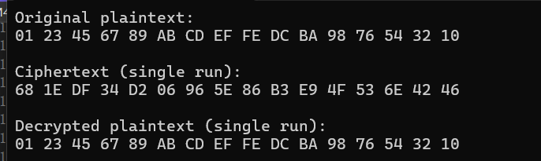

**SM4 软件实现 — 第1版**

## 概述

本项目为 SM4 分组密码算法的 **基础软件实现**，旨在完成算法的端到端加解密功能并进行性能测试。本版本为第1版（Baseline），目的是实现基础的加解密功能。

## 运行环境

* **操作系统**：Windows 11 (64-bit)
* **编译器**：Visual Studio 2022
* **处理器**：11th Gen Intel(R) Core™ i7-11800H @ 2.30GHz  
* **内存**：16.0 GB (15.7 GB 可用)  
* **系统类型**：64 位操作系统，基于 x64 的处理器  

## 代码结构

```
SM4/                # 仓库根目录
├── SM4/            # 源代码
│   └── sm4.cpp     # SM4 算法实现及测试程序
└── README.md       # 本说明文档
```

* `sm4.cpp` 包含：

  1. **常量定义**：初始向量 FK、轮常量 CK、S-盒 SBox。
  2. **密钥扩展**：`Gen_Round_Keys()` 函数生成 32 轮子密钥。
  3. **分组处理**：`ProcessBlock()` 函数完成单个 128 位分组的加密/解密。
  4. **主函数**：

     * 显示原始数据、单次加解密结果。
     * 性能测试：分别对加密和解密执行多次迭代（默认 10000 次），并输出平均耗时（μs）。


## 示例输出



## 性能基线

* 本版本实现一个简单的SM4加解密功能，接下来将做循环展开，SIMD，AES-NI 等优化。

## 下一步优化计划


1. **SIMD/硬件指令优化**：利用 AES-NI 或 SSE/AVX 指令并行处理多个分组。
2. **循环优化**：展开循环，减少分支开销。

---

