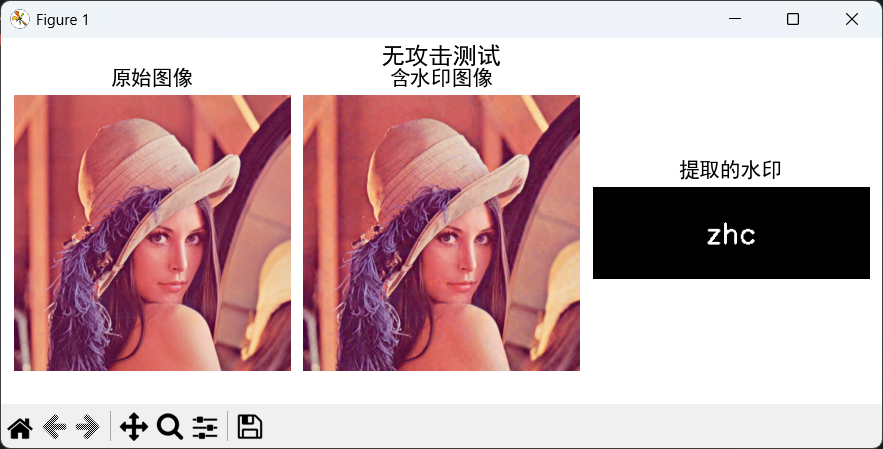
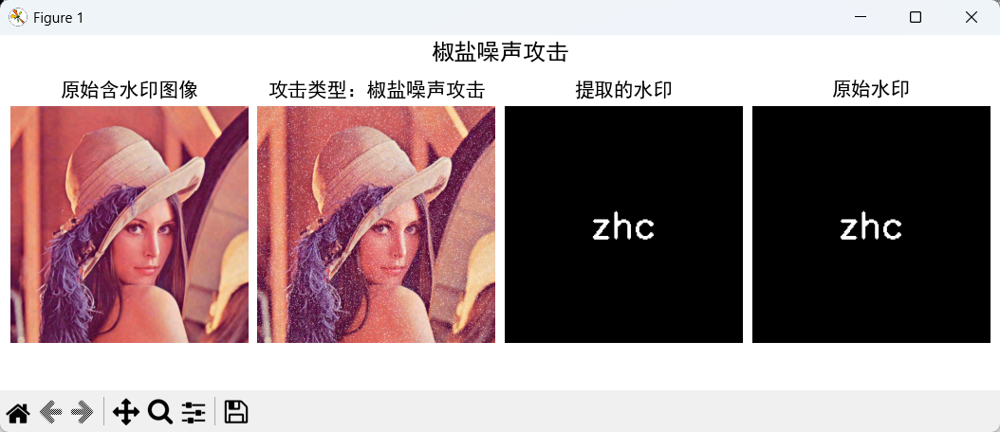
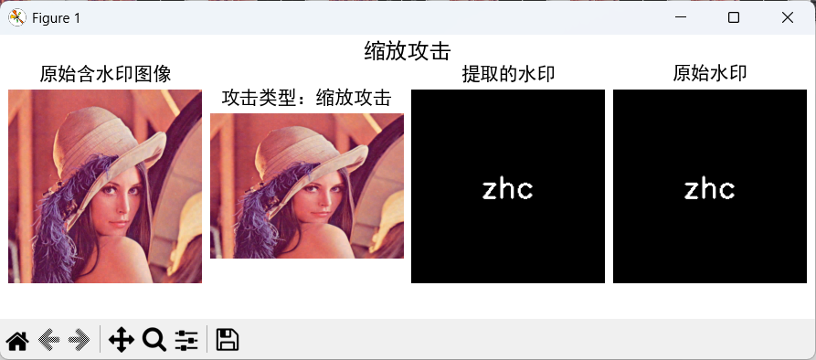
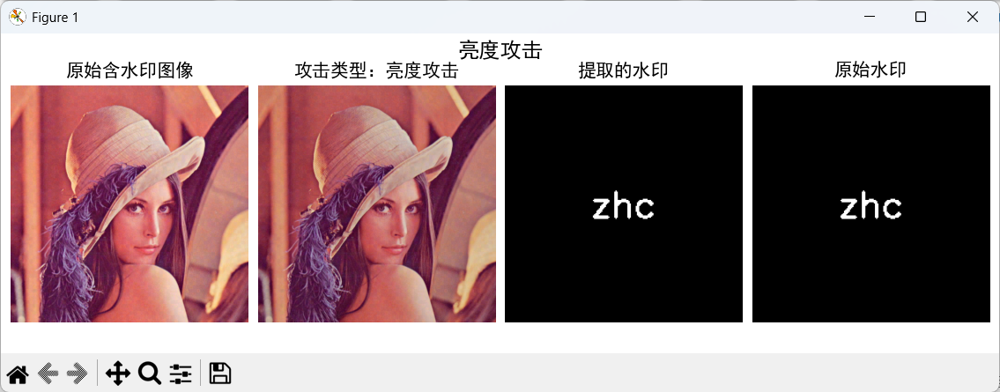
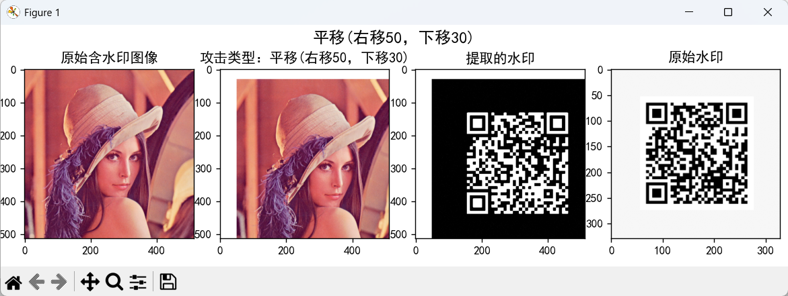

# 基于数字水印的图片泄露检测

## 项目概述

数字水印技术是将特定信息嵌入数字媒体（如图像）中，以实现版权保护、内容认证、泄露追踪等目标的有效手段。本项目实现了两种不同的数字水印方案：

- **文本盲水印**：将特定文本嵌入图片，支持字符串水印的嵌入和提取。

- **图片盲水印**：将特定的图像嵌入图片，实现灰度图片水印的嵌入与提取。

项目还集成了多种鲁棒性测试攻击（如翻转、平移、截取、旋转、噪声、亮度和对比度变化），用于验证水印对常见图像处理操作的抗干扰能力。

## 文件说明
```
Project-2-watermark/
├── img #存放鲁棒性测试的相关结果对比图
│ 
├── watermark-img.py #实现图片形式水印的嵌入提取及鲁棒性测试
├── watermark-text.py #实现文本（字符串）形式水印的嵌入提取及鲁棒性测试
│ 
├── watermark.png   #本项目中所用的图片水印
├── lena.jpg  #本项目中所选用的数字媒体（图像）
│ 
└── README.md # 项目说明
```

## 实现原理

### 最低有效位隐写（LSB）

基于最低有效位（LSB）隐写技术，将灰度水印图像的二值信息嵌入载体图像红色通道的最低有效位。

设载体图像的红色通道像素值为 $R(x,y)$，水印二值图像的像素值为 $W(x,y) \in \{0,1\}$，则嵌入过程为：

$$
R'(x,y) = 2 \times \left\lfloor \frac{R(x,y)}{2} \right\rfloor + W(x,y)
$$
```python
def lsb_encoder(copyright_image_path, original_image_path):
    # 将图片嵌入水印
    copyright_image = Image.open(copyright_image_path).convert("L")  # 转换为灰度图像
    original_image = Image.open(original_image_path).convert("RGB")
    copyright_image = copyright_image.resize(original_image.size)
    original_array = np.array(original_image, dtype=np.uint8)
    copyright_array = np.array(copyright_image, dtype=np.uint8)
    watermark = original_array.copy()
    copyright_binary = np.where(copyright_array < 128, 1, 0)
    watermark_r = watermark[:, :, 0]
    watermark_r = (watermark_r // 2) * 2
    assert watermark_r.shape == copyright_binary.shape, "尺寸不匹配"
    watermark_r = watermark_r + copyright_binary
    watermark_r = np.clip(watermark_r, 0, 255).astype(np.uint8)
    watermark[:, :, 0] = watermark_r
    watermarked_image = Image.fromarray(watermark)
    return watermarked_image
```
提取过程则为取水印图像红色通道像素的最低有效位：

$$
\hat{W}(x,y) = R'(x,y) \bmod 2
$$
```python
def lsb_decoder(image_input):
    """
    图片水印提取
    现在接受图像对象或文件路径
    """
    if isinstance(image_input, str):
        watermarked_image = Image.open(image_input).convert("RGB")
    else:
        watermarked_image = image_input.convert("RGB")
    watermarked_array = np.array(watermarked_image)
    extracted = (watermarked_array[:, :, 0] % 2) * 255
    extracted_image = Image.fromarray(extracted.astype(np.uint8))
    return extracted_image
```
为了提高鲁棒性，提取时还结合了次低有效位的加权组合：

$$
\hat{W}(x,y) = 0.7 \times \big( R'(x,y) \bmod 2 \big) + 0.3 \times \left( \left\lfloor \frac{R'(x,y)}{2} \right\rfloor \bmod 2 \right)
$$

并进行自适应阈值二值化及滤波降噪，以增强水印对对比度变化的抗干扰能力。

---

### 离散小波变换（DWT）

DWT 能将二维图像分解成不同频率子带，典型的二维DWT分解包含四个子带：

- **LL** ：低频近似分量，包含图像的主体结构信息。

- **LH, HL, HH** ：高频细节分量，包含边缘和纹理信息。

用公式表示为：

$I \xrightarrow{DWT} (LL, LH, HL, HH)$

在本系统中，水印嵌入主要针对 **LL** 子带进行，以兼顾水印的鲁棒性和视觉隐蔽性。低频成分通常在常见图像处理（压缩、缩放等）中相对稳定，嵌入水印后难以被轻易破坏。

---

### 离散余弦变换（DCT）

DCT 是将图像空间信号转换为频率成分的经典变换：

$$
F(u,v) = \sum_{x=0}^{N-1} \sum_{y=0}^{N-1} f(x,y) \cos\left[ \frac{\pi (2x+1) u}{2N} \right] \cos\left[ \frac{\pi (2y+1) v}{2N} \right]
$$

其中， $f(x,y)$ 是像素值， $F(u,v)$ 是频域系数。

DCT 变换使得图像能量集中在低频系数上，便于针对特定频率成分嵌入水印，同时减少对图像视觉质量的影响。

---

### 奇异值分解（SVD）

奇异值分解将矩阵  $M$  分解为：

$$
M = U S V^T
$$

其中， $U$、 $V$ 为正交矩阵； $S$ 为奇异值矩阵，奇异值包含矩阵的主要能量信息。

奇异值对矩阵的微小扰动不敏感，且对各种图像处理操作具有较强的稳定性，因此适合用于调制水印信息。

### 嵌入流程

1. **图像预处理与颜色空间转换**  
   将输入图像转换至 YUV 颜色空间，分别对三个通道处理。对宽高非偶数图像进行补白（padding），方便后续分块。

2. **二维小波变换（DWT）**  
   对每个通道进行二维 Haar 小波变换，得到低频子带  $C_A$ 和高频细节 $HVD$。

3. **分块处理**  
   将低频子带  $C_A$ 按  $4 \times 4$ 块划分为四维数组，方便独立处理。

4. **水印信息准备与加密**  
   将二值水印编码为一维序列，利用伪随机数生成器（PRNG）和密钥对每个块内部 DCT 系数顺序随机打乱，实现水印加密。

5. **变换域嵌入**  
   - 对每个块做二维 DCT。  
   - 将打乱顺序后的 DCT 矩阵进行 SVD 分解：

$$
M = U S V^T
$$
     
   - 根据水印位  $w_m^1 \in \{0,1\}$，调制奇异值  $S$ 的前两项：

$$
     s_k = \left( \left\lfloor \frac{s_k}{d_k} \right\rfloor + \frac{1}{4} + \frac{1}{2} w_m^1 \right) \times d_k, \quad k=0,1
$$
     
 其中， $d_1$, $d_2$  为调制步长，控制水印强度与鲁棒性。  
   - 用调整后的奇异值重构 DCT 矩阵，逆 DCT 得到加水印块。

6. **图像重构**  
   将所有处理后的块重新组合成完整的低频子带，通过逆小波变换重构三通道图像，合并为含水印彩色图像。

```python
#嵌入示例
bwm = WaterMark(password_img=1, password_wm=1)
bwm.read_img('lena.jpg')
wm_str = 'zhc'
bwm.read_wm(wm_str, mode='str')
bwm.embed('output/embedded.png')

len_wm = len(bwm.wm_bit)
ori_img_shape = cv2.imread('lena.jpg').shape[:2]
h, w = ori_img_shape
```

---

### 提取流程

1. 对含水印图像进行同样的预处理、颜色空间转换和小波分解。

2. 按同样分块策略，对每个块做 DCT 和打乱。

3. 对打乱后的 DCT 矩阵做 SVD 分解。

4. 通过判断奇异值调制余数恢复水印位：  

$$
w_m = 1, \quad \text{if } s_0 \bmod d_1 > \frac{d_1}{2}
$$

否则

$$
w_m = 0
$$


5. 多通道多轮次嵌入的水印位求平均，利用一维 k-means 聚类算法完成二值阈值判定，提高提取准确率。

```python
#提取部分关键代码
bwm1 = WaterMark(password_img=1, password_wm=1)
wm_extract = bwm1.extract('output/embedded.png', wm_shape=len_wm, mode='str')
```
---
## 鲁棒性测试

### 文本盲水印的鲁棒性测试

对嵌入水印的图像，执行以下攻击后提取水印并观察效果：

| 攻击类型   | 描述                         |
|------------|------------------------------|
| 截取攻击1  | 裁剪图像特定区域，参数已知   |
| 截取攻击2  | 裁剪图像特定区域，参数未知，需估计恢复 |
| 旋转攻击   | 顺时针旋转一定角度，并逆向恢复 |
| 缩放攻击   | 缩放至指定尺寸，并逆向恢复   |
| 亮度攻击   | 调整亮度比例，及逆向恢复     |
| 对比度攻击 | 通过对比度和伽马校正调整图像 |
| 椒盐噪声攻击 | 在图像中加入椒盐噪声       |
| 遮挡攻击   | 在图像随机区域遮挡部分像素   |

其中部分攻击配合对应的恢复算法，增强水印的鲁棒提取成功率。
```python
#相关代码
def test_robustness(attack_func, recover_func, attack_params, recover_params,
                    case_name, embedded_path, len_wm, original_wm, ori_img_shape=None)

def contrast_gamma_att(input_filename, output_file_name, alpha=1.2, gamma=1.1)

for case in test_cases:
    wm_extract = test_robustness(
        attack_func=case["attack_func"],
        recover_func=case["recover_func"],
        attack_params=case["attack_params"],
        recover_params=case["recover_params"],
        case_name=case["name"],
        embedded_path='output/embedded.png',
        len_wm=len_wm,
        original_wm=wm_str,
        ori_img_shape=ori_img_shape
    )

```
---

### 3.2 图片盲水印的鲁棒性测试

针对水印图像，执行以下处理后提取水印图像并进行视觉对比：

| 攻击类型   | 说明                   |
|------------|------------------------|
| 水平翻转   | 水平镜像翻转           |
| 垂直翻转   | 垂直镜像翻转           |
| 平移       | 右移50像素，下移30像素 |
| 截取       | 裁剪图像中心区域80%大小 |
| 对比度增强 | 对比度放大至1.5倍       |
| 对比度减弱 | 对比度降低至0.5倍       |

采用中值滤波、自适应阈值等后处理技术，提升提取水印图像的清晰度和辨识度。
```python
#部分相关代码
def robustness_test(watermarked_img_path, original_watermark_path):
 ………
test_cases = [
        {"name": "水平翻转", "func": lambda img: img.transpose(Image.FLIP_LEFT_RIGHT)},
        {"name": "垂直翻转", "func": lambda img: img.transpose(Image.FLIP_TOP_BOTTOM)},
        {"name": "平移(右移50，下移30)", "func": lambda img: translate_image(img, dx=50, dy=30)},
        {"name": "截取中心80%区域", "func": lambda img: img.crop((
            int(img.width * 0.1),
            int(img.height * 0.1),
            int(img.width * 0.9),
            int(img.height * 0.9)))},
        {"name": "对比度增强1.5倍", "func": lambda img: ImageEnhance.Contrast(img).enhance(1.5)},
        {"name": "对比度减弱0.5倍", "func": lambda img: ImageEnhance.Contrast(img).enhance(0.5)}
    ]
……
  results = []
    for case in test_cases:
        print(f"执行测试：{case['name']}")

        # 应用攻击
        attacked_img = case['func'](watermarked_img.copy())
```

## 鲁棒性测试效果可视化
### 文本水印测试
我们选取的文本为 **"zhc"**,将其作为水印嵌入图片，原始的嵌入效果如下，我们可以发现，肉眼分辨不出二者的区别，我们可以成功从其中提取到水印：



下面我们来看各种攻击下的提取效果：

**1.截图攻击（知道参数）**


**2.截图攻击（不知道参数）**

可以通过裁剪参数估计，然后恢复裁剪区域，最后水印对其提取，详细代码见py文件


**3.椒盐噪声攻击**

图片中加入噪声：



**4.旋转攻击**

我们将图片旋转一定角度：


**5.遮挡攻击**

遮挡图片的一定区域：


**6.缩放攻击**



**7.亮度攻击**

我们将亮度调暗，来进行提取测试



**8.对比度攻击**

调节对比度进行提取测试：


通过上面的图，我们可以看到我们的项目鲁棒性良好，针对各种攻击，均能有效的提取出水印，打印出的水印信息也可进一步佐证：


### 图片水印测试

我们选取的水印图片如下所示：
| 水印 | 对应网址 | 扫描结果 |
|------|----------|----------|
|  | [https://qr61.cn/ochC8z/qj7sJ1J](https://qr61.cn/ochC8z/qj7sJ1J) |  |

**当我们在以下测试中提取的水印能够正确扫码时出现结果时，证明我们的水印提取成功**

下面我们来看各种攻击的鲁棒性测试,经过实际扫码测试，均可成功访问对应页面，可自行手机扫码验证：

**1.水平反转**


**2.垂直反转**


**3.平移攻击**



**4.截取攻击**


**5.对比度增强**


**6.对比度减弱**


