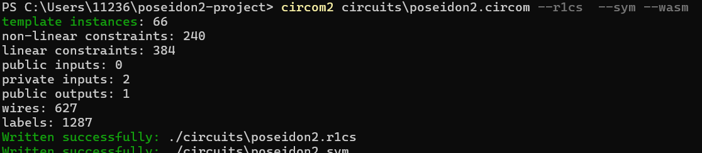
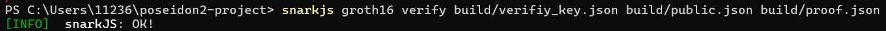

# Project-3-poseidon2
## 概述
本项目利用**Circom语言**和**snarkjs工具链**实现了Poseidon2哈希函数的零知识证明电路。核心目标是通过电路验证私有输入的哈希结果与公开声明的一致性。本实现基于论文《Poseidon2: A Faster Version of the Poseidon Hash Function》中描述的算法，使用(n,t,d)=(256,3,5)参数。

**环境准备：**
- **Circom**: 用于编写零知识证明电路
- **snarkjs**: 用于零知识证明的命令行工具。
- **Node.js**: 生成Witness 。

## 电路设计说明
### Poseidon2 算法实现
电路的核心是 `Poseidon2` 模板，它包含以下关键组件：
1. **状态初始化**：
   - 初始状态设置为 `[in0, in1, 0]`，其中 `in0` 和 `in1` 是私有输入，第三个元素是容量（固定为0）。
2. **轮函数**：
   - 总轮数 = 8 (全轮) + 56 (部分轮) = 64 轮
   - 前4轮和后4轮为全轮，中间56轮为部分轮
   ```mermaid
   graph LR
   A[输入状态] --> B[添加轮常数]
   B --> C{S盒类型判断}
   C -->|全轮| D[全元素S盒变换]
   C -->|部分轮| E[首元素S盒变换]
   D --> F[MDS矩阵乘法]
   E --> F
   F --> G[输出状态]
3. **单轮操作 (`Poseidon2Round`)**：
   - **添加轮常数**：每轮为状态中的每个元素添加预计算的常数（从 `roundnum.txt` 加载）
   - **S盒应用**：
     - 全轮：所有3个元素都进行S盒变换（ $x^5$）
     - 部分轮：仅第一个元素进行S盒变换
   - **MDS矩阵乘法**：使用固定矩阵进行线性变换
4. **输出**：最后一轮状态的第一个元素作为哈希输出
### 关键参数
- **S盒**： $x^5$
- **MDS矩阵**：
  ```circom
  [
    [5, 7, 1],
    [3, 4, 1],
    [1, 1, 2]
  ]
  ```
- **轮常数**：64轮×3个元素（完整列表见 `roundnum.txt`）
## 步骤
按照以下步骤来编译电路、生成 Witness、创建证明并验证它。
### 1. 编译电路
将Poseidon2电路描述编译为R1CS和WASM模块。
```bash
circom2 circuits\poseidon2.circom --r1cs  --sym --wasm -o build
```

### 2.准备输入文件
我们需要准备，私有输入 `in_private` 和公共输出 `hash_output`。`hash_output` 必须与 `in_private` 经过 Poseidon2 哈希后的结果相匹配。
输入示例（c是a,b经过Poseidon2 哈希后的结果）：

**`input.json` 示例：**
```json
{
  "in_private": ["a", "b"],
  "hash_output": "c"
}
```
### 4. 生成 Witness
生成见证文件。
```bash
node build/generate_witness.js build/poseidon2.wasm input.json build/witness.wtns
```
### 5.启动Powers of Tau
为后续的可信设置生成初始参数。输出文件`pot12_0000.ptau`包含初始参数，但尚未包含任何随机性。
```bash
snarkjs powersoftau new bn128 12 pot12_0000.ptau -v
```
### 6：贡献随机性（一）
向Powers of Tau参数中添加随机性，增强安全性。
```bash
snarkjs powersoftau contribute pot12_0000.ptau pot12_0001.ptau --name="First contribution" -v
```
### 7:参数优化
将参数转换为Groth16证明系统所需的格式，生成最终Powers of Tau文件`pot12_final.ptau`。
```bash
snarkjs powersoftau prepare phase2 pot12_0001.ptau pot12_final.ptau -v
```
### 8.生成Groth16密钥
创建与特定电路关联的证明密钥。输出初始证明密钥文件`poseidon2_0000.zkey`。
```bash
snarkjs groth16 setup build/poseidon2.r1cs pot12_final.ptau poseidon2_0000.zkey
```
### 9：贡献随机性（二）
为电路特定的证明密钥添加随机性。
```bash
snarkjs zkey contribute poseidon2_0000.zkey poseidon2.zkey --name="Second contribution" -v
```
### 10：导出验证密钥
从证明密钥中提取验证密钥。
```bash
snarkjs zkey export verificationkey poseidon2.zkey verification_key.json
```
### 11：生成证明
利用见证文件和证明密钥创建零知识证明。
```bash
snarkjs groth16 prove poseidon2.zkey witness.wtns proof.json public.json
```
### 12：验证证明
检查证明是否有效。
```bash
snarkjs groth16 verify verification_key.json public.json proof.json
```
我们从图中可以看到证明有效，我们已经成功进行了Groth16证明：

