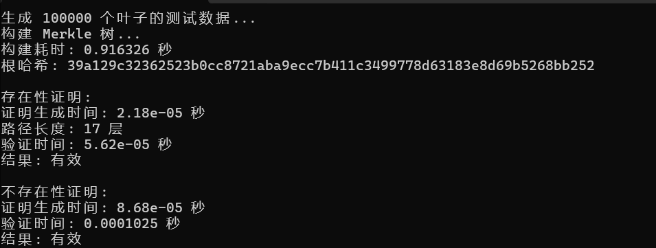
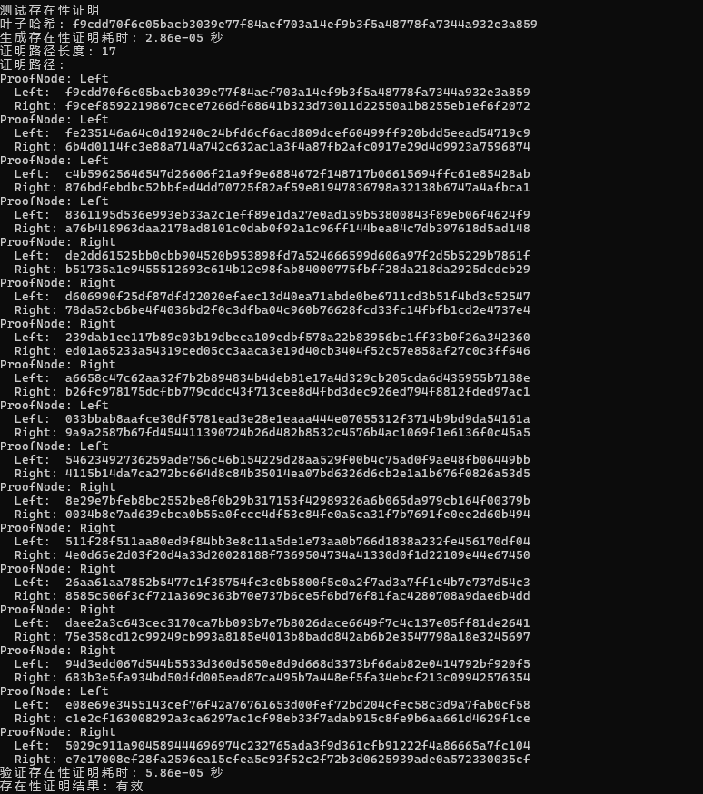
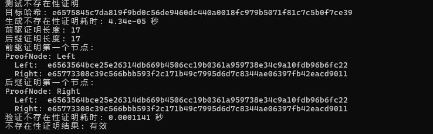

# 基于SM3 实现的 Merkle 树

## 概述

本系统基于 SM3 哈希算法实现符合 RFC6962 标准的 Merkle 树，支持大规模数据（10万叶子节点）的高效处理，并提供叶子的存在性证明和不存在性证明功能。系统充分利用 SM3 的安全特性和并行计算能力，实现了高性能的树构建和证明验证。

## Merkle原理

### Merkle 树结构

Merkle 树是二叉树结构，定义如下：

- **叶子节点**： $L_i = H(data_i)$  
- **内部节点**： $N_{i,j} = H(N_{i,k} \parallel N_{k+1,j})$  
- **根节点**： $Root = H(N_{0,n-1})$

其中 $H$ 是 SM3 哈希函数。

---

### 存在性证明

对于叶子 $L_i$，存在性证明路径为：

$$
Path_i = \{(sibling_0, pos_0), (sibling_1, pos_1), \cdots, (sibling_{k-1}, pos_{k-1})\}
$$

其中 $pos_j$ 表示兄弟节点的位置（左/右）

验证过程：

$$
H(\cdots H(H(leaf \parallel sibling_0) \parallel sibling_1) \cdots ) = rootHash
$$

---

### 不存在性证明

对于不存在元素 $x$，证明包括：

- 前驱叶子 $L_p$ 的存在性证明
- 后继叶子 $L_s$ 的存在性证明
- 验证 $L_p < H(x) < L_s$

数学表示：

$$
Proof_{non-exist} = (Proof_{exist}(L_p), Proof_{exist}(L_s))
$$

满足：

$$
L_p < H(x) < L_s
$$

---

## 关键算法实现

### 1. Merkle 树构建

**算法步骤：**

- 计算所有叶子的 SM3 哈希
- 对叶子节点按哈希值排序
- 递归构建父节点：每两个节点组合： $parent = H(left \parallel right)$  
  （奇数节点时复制最后一个节点）

**代码实现：**

```cpp
void MerkleTree::buildTree(const vector<vector<uint8_t>>& data) {
    root = nullptr;
    createLeaves(data);
    
    vector<shared_ptr<Node>> currentLevel = leaves;
    root = buildTreeRecursive(currentLevel);
}

shared_ptr<MerkleTree::Node> 
MerkleTree::buildTreeRecursive(vector<shared_ptr<Node>>& nodes) {
    if (nodes.size() == 1) return nodes[0];
    
    if (nodes.size() % 2 != 0) {
        auto copyNode = make_shared<Node>();
        memcpy(copyNode->hash, nodes.back()->hash, 32);
        nodes.push_back(copyNode);
    }
    
    vector<shared_ptr<Node>> parents;
    for (size_t i = 0; i < nodes.size(); i += 2) {
        auto parent = make_shared<Node>();
        parent->left = nodes[i];
        parent->right = nodes[i+1];
        
        uint8_t combined[64];
        memcpy(combined, nodes[i]->hash, 32);
        memcpy(combined + 32, nodes[i+1]->hash, 32);
        sm3_hash_parallel(combined, 64, parent->hash);
        
        nodes[i]->parent = parent;
        nodes[i+1]->parent = parent;
        parents.push_back(parent);
    }
    
    return buildTreeRecursive(parents);
}
```

---

### 2. 存在性证明

**算法步骤：**

- 定位目标叶子节点
- 从叶子到根收集路径：
  - 对每个父节点，记录兄弟节点和位置
- 验证时：
  - 从叶子哈希开始
  - 按路径顺序组合兄弟节点哈希
  - 计算根哈希并与实际比较

**代码实现：**

```cpp
vector<MerkleTree::ProofNode> 
MerkleTree::generateProofPath(shared_ptr<Node> node) const {
    vector<ProofNode> proof;
    while (node && !node->parent.expired()) {
        auto parent = node->parent.lock();
        ProofNode pnode;
        
        if (parent->left == node) {
            memcpy(pnode.left, node->hash, 32);
            memcpy(pnode.right, parent->right->hash, 32);
            pnode.isLeft = true;
        } else {
            memcpy(pnode.left, parent->left->hash, 32);
            memcpy(pnode.right, node->hash, 32);
            pnode.isLeft = false;
        }
        
        proof.push_back(pnode);
        node = parent;
    }
    return proof;
}

bool MerkleTree::verifyInclusionProof(...) {
    uint8_t currentHash[32];
    memcpy(currentHash, leafHash, 32);
    
    for (const auto& pnode : proof) {
        uint8_t combined[64];
        if (pnode.isLeft) {
            memcpy(combined, currentHash, 32);
            memcpy(combined + 32, pnode.right, 32);
        } else {
            memcpy(combined, pnode.left, 32);
            memcpy(combined + 32, currentHash, 32);
        }
        sm3_hash_parallel(combined, 64, currentHash);
    }
    return compareHashes(currentHash, rootHash) == 0;
}
```

---

### 3. 不存在性证明

**算法步骤：**

- 在排序的叶子节点中定位目标位置
- 找到前驱 $L_p$ 和后继 $L_s$ 叶子
- 验证 $L_p < H(x) < L_s$
- 生成 $L_p$ 和 $L_s$ 的存在性证明
- 验证时：
  - 验证 $L_p$ 和 $L_s$ 的存在性
  - 验证 $L_p < H(x) < L_s$

**代码实现：**

```cpp
pair<vector<MerkleTree::ProofNode>, vector<MerkleTree::ProofNode>> 
MerkleTree::generateExclusionProof(const uint8_t* nonLeafHash) const {
    auto [predecessor, successor] = findPredecessorSuccessor(nonLeafHash);
    
    if (compareHashes(predecessor->hash, nonLeafHash) >= 0 || 
        compareHashes(successor->hash, nonLeafHash) <= 0) {
        return {};
    }
    
    return {generateProofPath(predecessor), generateProofPath(successor)};
}

bool MerkleTree::verifyExclusionProof(...) {
    uint8_t predLeafHash[32];
    if (predProof[0].isLeft) memcpy(predLeafHash, predProof[0].left, 32);
    else memcpy(predLeafHash, predProof[0].right, 32);
    
    if (!verifyInclusionProof(predLeafHash, rootHash, predProof)) {
        return false;
    }

    // 提取后继叶子哈希并验证
    // ...

    return compareHashes(predLeafHash, nonLeafHash) < 0 && 
           compareHashes(succLeafHash, nonLeafHash) > 0;
}
```
---
## 性能优化
### 1.进行多线程并行计算
```cpp
void sm3_hash_parallel(const uint8_t* msg, size_t len, uint8_t hash[32]) {
    // 使用多线程并行处理数据块
    const size_t num_blocks = len / 64;
    const size_t num_threads = min(thread::hardware_concurrency(), num_blocks);
    if (num_blocks < 128 || num_threads <= 1) {
    } else {
        vector<thread> threads;
        vector<vector<uint32_t>> thread_states(num_threads);
        for (size_t i = 0; i < num_threads; i++) {
            threads.emplace_back([&, i](){
            });
        }
        // 等待完成并合并结果
    }
}
```
---
### 2.内存管理优化
使用 shared_ptr 自动管理节点内存，预分配节点向量空间，避免不必要的拷贝
```cpp
void createLeaves(const vector<vector<uint8_t>>& data) {
    leaves.reserve(data.size()); // 预分配   
    for (const auto& item : data) {
        auto leaf = make_shared<Node>(); 
        sm3_hash_parallel(item.data(), item.size(), leaf->hash);
        leaves.push_back(leaf);
    }
    sort(leaves.begin(), leaves.end(), HashCompare());
}

```
---
## 测试
### 数据生成
我们用以下函数，来随机生成我们测试所用的10w个数据。

注：数据随机生成，所以每次构造的树和各节点的哈希不同
```cpp
vector<vector<uint8_t>> generate_data(size_t count, size_t length) {
    vector<vector<uint8_t>> data;
    data.reserve(count);

    random_device rd;
    mt19937 gen(rd());
    uniform_int_distribution<unsigned> dis(0, 255);

    for (size_t i = 0; i < count; i++) {
        vector<uint8_t> item(length);
        for (size_t j = 0; j < length; j++) {
            item[j] = static_cast<uint8_t>(dis(gen));
        }
        data.push_back(item);
    }

    return data;
}
```
---
### 测试结果
运行结果如图所示，Merkle 树的构建以及存在性证明和不存在性证明均成功，如图所示：


下面是详细的存在性证明和不存在证明的详细过程，以另一组数据为例：

存在性证明的证明路径：



不存在证明的前驱及后继证明：


