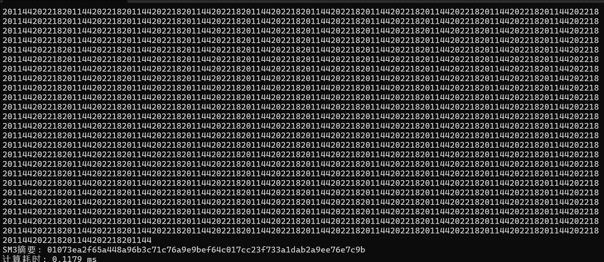

# SM3 软件实现与多级优化说明

## 概述

本项目基于 SM3 哈希算法的 **基础软件实现**，逐步引入多层次优化（宏展开、循环展开、SIMD 向量化、多线程并行），以提升算法执行效率。以下文档将详细说明算法原理、优化思路、数学推导及具体代码实现。


---
## 运行环境

* 操作系统：Windows 11 (64-bit)
* 编译器：Visual Studio 2022 (MSVC, C++14)
* 处理器：Intel Core i7-11800H @ 2.30GHz
* 内存：16 GB

---


---

## SM3 的实现与优化

SM3 是中国国家密码局发布的杂凑算法，输出 256 位摘要。其核心由消息填充、消息扩展、布尔置换和线性压缩函数构成。

### 消息扩展
将输入分组 `M[i]` 扩展为 68 个 `W[j]` 和 64 个 `W1[j]`：

$$
W[j] = P1(W[j-16] \oplus W[j-9] \oplus (W[j-3] \lll 15)) \oplus (W[j-13] \lll 7) \oplus W[j-6]
$$

$$
W1[j] = W[j] \oplus W[j+4]
$$

### 压缩函数
对每个分组使用 64 轮迭代：

$$
SS1 = (A \lll 12 + E + T_j \lll (j\bmod32)) \lll 7,
SS2 = SS1 \oplus (A \lll 12)
$$

$$
TT1 = FF_j(A,B,C) + D + SS2 + W1[j],
TT2 = GG_j(E,F,G) + H + SS1 + W[j]
$$

更新 ABCD EFGH 并异或回 `state`


---

## 基线实现

```cpp
// 省略头文件...
void sm3_compress(uint32_t state[8], const uint8_t block[64]) {
    uint32_t W[68], W1[64];
    // 消息扩展
    for (int i = 0; i < 16; ++i)
        W[i] = load_be32(block + 4*i);
    for (int j = 16; j < 68; ++j)
        W[j] = P1(W[j-16] ^ W[j-9] ^ ROTL(W[j-3],15))
               ^ ROTL(W[j-13],7) ^ W[j-6];
    for (int j = 0; j < 64; ++j)
        W1[j] = W[j] ^ W[j+4];

    // 64 轮压缩
    auto A=state[0], B=state[1], ...;
    for (int j = 0; j < 64; ++j) {
        uint32_t Tj = (j<16?0x79CC4519:0x7A879D8A);
        uint32_t SS1 = ROTL(...);
        // ...
    }
    // 更新 state
}
```


---

## 优化点一：宏展开与内联函数

### 优化动机

SM3 中多次使用的基本置换和布尔函数（`ROTL`、`P0`/`P1`、`FF`、`GG`）如果以普通函数实现，会带来函数调用开销和分支判断。通过宏展开可以：减少函数调用开销和分支判断，提升编译器内联及优化效果。
### 数学推导

- **置换函数**  
  $$P_0(x)=x\oplus(x\lll 9)\oplus(x\lll 17),\quad
    P_1(x)=x\oplus(x\lll15)\oplus(x\lll23).$$  
  线性变换可合并多重移位与异或，编译器会在宏展开后优化为最少指令。

- **FF/GG**  
  定义：
  
FFj(x, y, z) =  
    x ⊕ y ⊕ z                         ; 当 j < 16  
    (x ∧ y) ∨ (x ∧ z) ∨ (y ∧ z)       ; 当 j ≥ 16
  
GGj(x, y, z) =  
    x ⊕ y ⊕ z                         ; 当 j < 16  
    (x ∧ y) ∨ (¬x ∧ z)                ; 当 j ≥ 16
### 关键代码

```cpp
#define ROTL(x,n) (((x)<<(n))|((x)>>(32-(n))))
#define P0(x)   ((x) ^ ROTL(x,9) ^ ROTL(x,17))
#define P1(x)   ((x) ^ ROTL(x,15) ^ ROTL(x,23))
#define FF0(x,y,z) ((x) ^ (y) ^ (z))
#define FF1(x,y,z) (((x)&(y))|((x)&(z))|((y)&(z)))
#define GG0(x,y,z) FF0(x,y,z)
#define GG1(x,y,z) FF1(x,y,z)
```


---

## 优化点二：循环展开

### 优化动机

减少循环条件判断和索引计算开销，提升流水线吞吐。

### 关键代码

```cpp
// 展开 4 轮为一组
for (int j = 0; j < 64; j += 4) {
    // 轮 0
    SS1 = calc_SS1(A,E,Tj[j]); SS2 = SS1^(...);
    TT1 = FF(A,B,C)+D+SS2+W1[j]; TT2=...;
    D=C; C=ROTL(B,9); B=A; A=TT1;
    // 轮 1,2,3 同理
}
```

* **减少 `j<64` 判断次数**：原 64 次 -> 16 次。
* **索引计算合并**：`j+k` 直接展开，不再动态计算。

---

## 优化点三：SIMD 向量化

### 优化动机

利用 x86 SSE/AVX 指令同时处理多组数据，提高数据并行度。

### 消息扩展向量化

```cpp
// W1 计算并行 4 个元素
for (int j = 0; j < 64; j += 4) {
    __m128i vW = _mm_loadu_si128((__m128i*)(W + j));
    __m128i vW4 = _mm_loadu_si128((__m128i*)(W + j + 4));
    __m128i vW1 = _mm_xor_si128(vW, vW4);
    _mm_storeu_si128((__m128i*)(W1 + j), vW1);
}
```

* 每次读写 128 位（4×32 位），速度 \~4× 标量版本。
* `_mm_xor_si128` 并行执行 4 路异或。

### 常量加载向量化

```cpp
        __m128i tj_vec = _mm_set1_epi32(Tj[j]);
        __m128i w_vec = _mm_set1_epi32(W[j]);
        __m128i w1_vec = _mm_set1_epi32(W1[j]);

        uint32_t tj = _mm_extract_epi32(tj_vec, 0);
        uint32_t w_val = _mm_extract_epi32(w_vec, 0);
        uint32_t w1_val = _mm_extract_epi32(w1_vec, 0);
```

* 减少内存加载分支，利用向量寄存器广播。

---

## 优化点四：多线程并行

### 优化动机

对大消息，单线程串行压缩所有 64-byte 分组无法充分利用多核。拆分为多线程可使每线程各自持有独立初始状态 IV

并行压缩分配给它的若干块

然后汇总各线程最终状态为“伪块”，再做一次压缩到全局

### 关键代码

```cpp
size_t NB = pad_len / 64;
size_t NT = std::min(std::thread::hardware_concurrency(), NB);

// 1. 准备每线程状态副本
std::vector<std::vector<uint32_t>> thread_states(NT, std::vector<uint32_t>(8));
for (size_t t = 0; t < NT; ++t)
    std::memcpy(thread_states[t].data(), IV, sizeof(IV));

// 2. 并行压缩
size_t offset = 0;
for (size_t t = 0; t < NT; ++t) {
    size_t cnt = NB/NT + (t < NB%NT ? 1 : 0);
    threads.emplace_back([&, t, offset, cnt](){
        process_blocks(thread_states[t].data(),
                       padded + offset*64,
                       cnt);
    });
    offset += cnt;
}

// 3. 等待并合并
for (auto &th : threads) th.join();
std::memcpy(state, IV, sizeof(IV));
for (size_t t = 0; t < NT; ++t) {
    uint8_t tmpblk[64];
    for (int i = 0; i < 8; ++i)
        store_be32(tmpblk + 4*i, thread_states[t][i]);
    sm3_compress_optimized(state, tmpblk);
}
```

---
## 性能测试
优化前：


优化后：


另外在大数据（如KB及MB级）上的优化效果更为显著，整体提升明显，在一倍以上
优化前：


优化后：


可以看到，算法效率高，且结果正确：

经多次大数测试得到以下表格：
| 优化版本 | 优化内容说明                                           | 平均时间  |
|----------|--------------------------------------------------------|-----------|
| 原始版本 | 无优化，标准串行实现                                  | 0.25 ms   |
| 优化版本 | 宏展开 + 消息扩展优化 + 主循环展开 + SIMD 指令加速   | 0.11 ms   |
