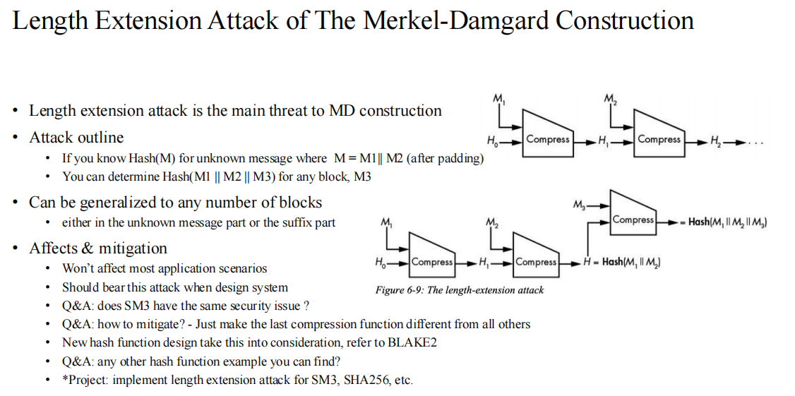
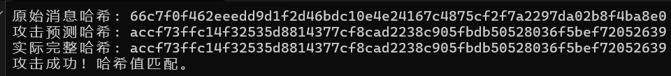

# SM3 长度扩展攻击

## 概述
本报告详细分析了 SM3 哈希算法的长度扩展攻击漏洞。长度扩展攻击是 Merkle-Damgård 结构哈希函数的固有弱点，攻击者可以在不知道原始消息内容的情况下，仅凭原始消息的哈希值和长度，构造出包含附加消息的新消息并预测其哈希值。
---
## 长度扩展攻击原理

### 1. SM3 的 Merkle-Damgård 结构
SM3 采用 Merkle-Damgård 结构，其核心流程可表示为：


- $H_0$ = $IV$ 
- $H_{i+1}$ = compress($H_i$, $M_i$) 
- Hash = $H_n$


其中：

- $H_i$ 是第 $i$ 个分组的中间状态  
- $M_i$ 是第 $i$ 个消息分组  
- $\text{compress}$ 是压缩函数  

---

### 2. 填充规则

SM3 填充规则可数学表示为：

$$
\text{Padding}(M) = M \parallel 1 \parallel 0^k \parallel \text{len}(M)
$$

其中：

- $k$ 是最小的非负整数使得 $|M| + 1 + k + 64 \equiv 0 \pmod{512}$  
- $\text{len}(M)$ 是消息长度的 64 位大端表示  

---

### 3. 攻击原理

设：

- 原始消息： $M$  
- 原始消息长度： $L_M$  
- 原始哈希： $H(M)$  
- 附加消息： $A$  

攻击者可以构造新消息：

$$
M' = \text{Padding}(M) \parallel A
$$

其哈希值可通过以下方式计算：

$$
H(M') = \text{SM3}(A, \text{IV}=H(M), \text{总长度}=|\text{Padding}(M)| + |A|)
$$

数学推导：

- $H(M)$ 是处理 $M$ 及其填充后的最终状态  
- 在 $H(M')$ 的计算中，初始状态设为 $H(M)$  
- 接着处理附加消息 $A$ 及其填充  
- 由于填充规则仅依赖总长度，攻击者可正确计算 $A$ 的填充  

---

## 关键函数

### 1.自定义 IV 的 SM3 计算

```cpp
void sm3_hash_custom_iv(const uint8_t* msg, size_t len, uint8_t hash[32], 
                        const uint32_t iv[8], uint64_t total_bit_len) 
{
    // 计算填充长度
    size_t pad_len = ((len + 1 + 8 + 63) / 64) * 64;
    uint8_t* padded = new uint8_t[pad_len]();
    
    // 填充消息
    memcpy(padded, msg, len);
    padded[len] = 0x80;
    for (int i = 0; i < 8; ++i) {
        padded[pad_len - 8 + i] = (total_bit_len >> ((7 - i) * 8)) & 0xFF;
    }
    
    // 使用自定义 IV 处理分组
    uint32_t state[8];
    memcpy(state, iv, sizeof(uint32_t) * 8);
    
    size_t num_blocks = pad_len / 64;
    for (size_t i = 0; i < num_blocks; i++) {
        sm3_compress_optimized(state, padded + i * 64);
    }
    
    // 输出哈希
    for (int i = 0; i < 8; ++i) {
        hash[4*i] = (state[i] >> 24) & 0xFF;
       .....
    }
    delete[] padded;
}
```
---

### 2.长度扩展攻击函数
```cpp
void length_extension_attack(const uint8_t* original_hash, const char* append_msg,
                             size_t append_len, size_t original_padded_len,
                             uint8_t new_hash[32]) 
{
    uint32_t iv_state[8];
    for (int i = 0; i < 8; i++) {
        iv_state[i] = (original_hash[4*i] << 24) |
                      (original_hash[4*i+1] << 16) |
                      (original_hash[4*i+2] << 8) |
                      original_hash[4*i+3];
    }

    uint64_t total_bit_len = uint64_t(original_padded_len + append_len) * 8;
    sm3_hash_custom_iv(
        reinterpret_cast<const uint8_t*>(append_msg),
        append_len,
        new_hash,
        iv_state,
        total_bit_len
    );
}

```
---
### 3. 填充长度计算
```cpp
size_t calculate_padded_length(size_t len) {
    // 填充规则: len + 1 (0x80) + 8 (长度字段) + 填充0
    return ((len + 1 + 8 + 63) / 64) * 64;
}
```
---
### 4.完整消息构造
```cpp
void generate_padded_block(const char* message, size_t len, uint8_t* padded_block) {
    uint64_t bit_len = static_cast<uint64_t>(len) * 8;
    size_t pad_len = calculate_padded_length(len);
    
    memset(padded_block, 0, pad_len);
    memcpy(padded_block, message, len);
    padded_block[len] = 0x80;

    for (int i = 0; i < 8; ++i) {
        padded_block[pad_len - 8 + i] = (bit_len >> ((7 - i) * 8)) & 0xFF;
    }
}
```
---
## 实验结果
采用先前实现的SM3算法，上述流程所述的未知消息设为字符串”abc“，而附加消息选定为字符串”abc“。

结果如下图，可以看到，攻击成功：


要想抵抗长度扩展攻击攻击，可对基于MD结构的算法进行改造，可以考虑使用盐值或截断哈希等方式，但是这也需要安全和效率的权衡。
