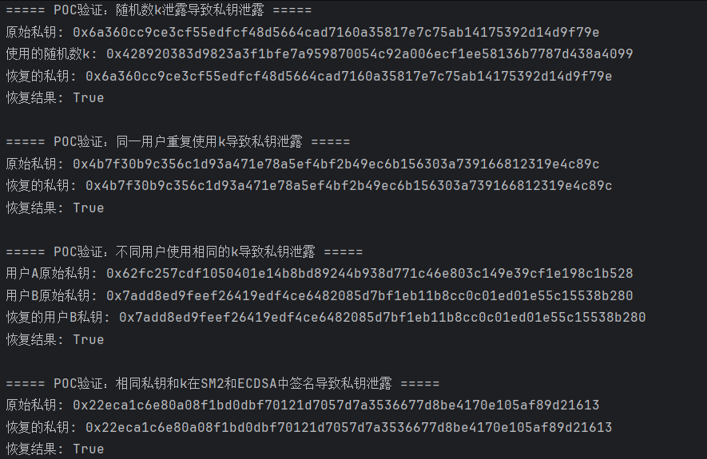

# SM2 签名算法误用场景的 POC 验证
## 概述

本项目基于中国商用密码标准 SM2 椭圆曲线公钥密码算法，实现了完整的密钥生成、数字签名、签名验证功能，并重点验证了四种常见的签名误用场景下私钥泄露的风险。通过数学推导和实际代码实现，证明了以下场景会导致私钥泄露：

- 随机数 k 泄露导致私钥泄露
- 同一用户重复使用 k 导致私钥泄露
- 不同用户使用相同 k 导致私钥泄露
- 相同私钥和 k 在 SM2 和 ECDSA 中签名导致私钥泄露

以下文档详细说明了算法原理、数学推导、误用场景分析及具体实现。

## SM2 签名算法

关于SM2签名与验证算法的原理与实现，SM2的实现文档中已经讲述，这里不在赘述

## 签名误用场景与验证

### 3.1 随机数 k 泄露导致私钥泄露

#### 原理

从签名方程出发：  

$$
s = (1 + d_A)^{-1} \cdot (k - r \cdot d_A) \mod n
$$

推导私钥 $d_A$ 的过程：

将方程两边同时乘以  $(1 + d_A)$:  

$$
s \cdot (1 + d_A) = k - r \cdot d_A \mod n
$$

展开左边： 

$$
s + s \cdot d_A = k - r \cdot d_A \mod n
$$

将所有包含 $d_A$ 的项移到左边：  

$$
s \cdot d_A + r \cdot d_A = k - s \mod n
$$

提取公因子  $d_A$:  

$$
d_A \cdot (s + r) = k - s \mod n
$$

求解  $d_A$:  

$$
d_A = (k - s) \cdot (s + r)^{-1} \mod n
$$

#### POC 实现

```python
def poc_leaking_k():
    """POC验证：随机数k泄露导致私钥泄露"""
    print("\n===== POC验证：随机数k泄露导致私钥泄露 =====")
    
    # 生成密钥对
    private, public = generate_keypair()
    user_id = "test_user"
    print(f"原始私钥: {hex(private)}")
    
    # 生成签名并记录使用的k值
    msg = "测试消息"
    k_value = secrets.randbelow(n - 1) + 1
    signature = generate_signature(private, msg, user_id, public, k_value)
    r, s = signature
    
    # 从泄露的k恢复私钥
    # 公式: dA = (k - s) * (s + r)^(-1) mod n
    denominator = (s + r) % n
    if denominator == 0:
        print("错误：分母为零，无法恢复私钥")
        return
    
    inv_denom = mod_inv(denominator, n)
    recovered_private = ((k_value - s) * inv_denom) % n
    
    print(f"使用的随机数k: {hex(k_value)}")
    print(f"恢复的私钥: {hex(recovered_private)}")
    print(f"恢复结果: {private == recovered_private}")
```
### 3.2 同一用户重复使用 k 导致私钥泄露

#### 原理

对消息 $M_1$ 和 $M_2$ 使用相同 $k$ 生成签名：

$$
s_1 = (1 + d_A)^{-1} \cdot (k - r_1 \cdot d_A) \mod n
$$

$$
s_2 = (1 + d_A)^{-1} \cdot (k - r_2 \cdot d_A) \mod n
$$

推导私钥 $d_A$ 的过程：

将两个等式相减：

$$
s_1 - s_2 = (1 + d_A)^{-1} \cdot d_A \cdot (r_2 - r_1) \mod n
$$

移项并求解 $d_A$：

$$
d_A = (s_2 - s_1) \cdot \left[(s_1 - s_2) + (r_1 - r_2)\right]^{-1} \mod n
$$

---

#### POC 实现

```python
def poc_same_user_reused_k():
    """POC验证：同一用户重复使用k导致私钥泄露"""
    print("\n===== POC验证：同一用户重复使用k导致私钥泄露 =====")

    # 生成密钥对
    private, public = generate_keypair()
    user_id = "test_user"
    print(f"原始私钥: {hex(private)}")

    # 使用相同的k为两个消息生成签名
    k_value = secrets.randbelow(n - 1) + 1
    msg1 = "消息1"
    msg2 = "消息2"

    sig1 = generate_signature(private, msg1, user_id, public, k_value)
    sig2 = generate_signature(private, msg2, user_id, public, k_value)

    # 恢复私钥
    r1, s1 = sig1
    r2, s2 = sig2

    # 推导公式：dA = (s2 - s1) / (s1 - s2 + r1 - r2) mod n
    numerator = (s2 - s1) % n
    denominator = (s1 - s2 + r1 - r2) % n
    if denominator == 0:
        print("错误：分母为零，无法恢复私钥")
        return

    inv_denom = mod_inv(denominator, n)
    recovered_private = numerator * inv_denom % n

    print(f"恢复的私钥: {hex(recovered_private)}")
    print(f"恢复结果: {private == recovered_private}")
```
### 3.3 不同用户使用相同 k 导致私钥泄露

#### 原理

用户 A 和用户 B 使用相同 $k$ 生成签名：

$$
k = s_A \cdot (1 + d_A) + r_A \cdot d_A \mod n
$$

$$
k = s_B \cdot (1 + d_B) + r_B \cdot d_B \mod n
$$

---

用户 A 可计算 $k$：

$$
k = s_A \cdot (1 + d_A) + r_A \cdot d_A \mod n
$$

将 $k$ 代入用户 B 的签名表达式：

$$
s_B \cdot (1 + d_B) + r_B \cdot d_B = k \mod n
$$

求解用户 B 的私钥 $d_B$：

$$
d_B = (k - s_B) \cdot (s_B + r_B)^{-1} \mod n
$$

---

#### POC 实现

```python
def poc_different_users_same_k():
    """POC验证：不同用户使用相同的k导致私钥泄露"""
    print("\n===== POC验证：不同用户使用相同的k导致私钥泄露 =====")

    # 用户A
    private_A, public_A = generate_keypair()
    user_id_A = "userA"
    print(f"用户A原始私钥: {hex(private_A)}")

    # 用户B
    private_B, public_B = generate_keypair()
    user_id_B = "userB"
    print(f"用户B原始私钥: {hex(private_B)}")

    # 使用相同的k
    k_value = secrets.randbelow(n - 1) + 1

    # 用户A签名
    msgA = "AAA"
    sigA = generate_signature(private_A, msgA, user_id_A, public_A, k_value)

    # 用户B签名
    msgB = "BBB"
    sigB = generate_signature(private_B, msgB, user_id_B, public_B, k_value)

    # 计算用户A的k值
    rA, sA = sigA
    k_recovered = (sA * (1 + private_A) + rA * private_A) % n

    # 恢复用户B的私钥
    rB, sB = sigB
    denominator = (sB + rB) % n
    if denominator == 0:
        print("错误：分母为零，无法恢复私钥")
        return

    inv_denom = mod_inv(denominator, n)
    recovered_private_B = ((k_recovered - sB) * inv_denom) % n

    print(f"恢复的用户B私钥: {hex(recovered_private_B)}")
    print(f"恢复结果: {private_B == recovered_private_B}")
```
### 3.4 相同私钥和 k 在 SM2 和 ECDSA 中签名导致私钥泄露

#### 原理

使用相同 $k$ 生成 ECDSA 和 SM2 签名：

- **ECDSA 签名：**
  
$$
s_1 = k^{-1} \cdot (e_1 + r_1 \cdot d) \mod n
$$

- **SM2 签名：**
  
$$
s_2 = (1 + d)^{-1} \cdot (k - r_2 \cdot d) \mod n
$$

从 ECDSA 方程解出 $k$：

$$
k = s_1^{-1} \cdot (e_1 + r_1 \cdot d) \mod n
$$

代入 SM2 方程：

$$
s_2 = (1 + d)^{-1} \cdot \left[s_1^{-1} \cdot (e_1 + r_1 \cdot d) - r_2 \cdot d\right] \mod n
$$

最终求解私钥 $d$ 的公式为：

$$
d = (s_1 \cdot s_2 - e_1) \cdot (r_1 - s_1 \cdot s_2 - s_1 \cdot r_2)^{-1} \mod n
$$

---

#### POC 实现

```python
def poc_same_d_and_k_ecdsa_sm2():
    """POC验证：相同私钥和k在SM2和ECDSA中签名导致私钥泄露"""
    print("\n===== POC验证：相同私钥和k在SM2和ECDSA中签名导致私钥泄露 =====")

    # 生成密钥对
    private, public = generate_keypair()
    user_id = "test_user"
    print(f"原始私钥: {hex(private)}")

    # 使用相同的k
    k_value = secrets.randbelow(n - 1) + 1

    # ECDSA签名
    ecdsa_msg = "ECDSA消息"
    ecdsa_sig = ecdsa_sign(private, ecdsa_msg, k_value)

    # SM2签名
    sm2_msg = "SM2消息"
    sm2_sig = generate_signature(private, sm2_msg, user_id, public, k_value)

    # 计算ECDSA消息哈希
    ecdsa_msg_bytes = ecdsa_msg.encode('utf-8')
    e1 = int.from_bytes(sha256(ecdsa_msg_bytes).digest(), 'big') % n

    # 计算SM2消息哈希
    za = compute_user_hash(user_id, public[0], public[1])
    msg_full = za + sm2_msg
    msg_bytes = msg_full.encode('utf-8')
    hash_value = sm3.sm3_hash(func.bytes_to_list(msg_bytes))
    e2 = int(hash_value, 16)

    # 恢复私钥
    r1, s1 = ecdsa_sig
    r2, s2 = sm2_sig

    # 推导公式：d = (s1*s2 - e1) * inv(r1 - s1*s2 - s1*r2, n) mod n
    numerator = (s1 * s2 - e1) % n
    denominator = (r1 - s1 * s2 - s1 * r2) % n
    if denominator == 0:
        print("错误：分母为零，无法恢复私钥")
        return

    inv_denom = mod_inv(denominator, n)
    recovered_private = numerator * inv_denom % n

    print(f"恢复的私钥: {hex(recovered_private)}")
    print(f"恢复结果: {private == recovered_private}")
```
## 验证测试
由运行结果可知，我们已经验证了四种场景下的私钥泄露风险，均验证成功

