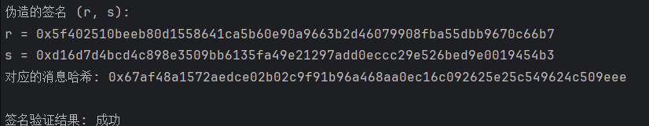

# 伪造中本聪的数字签名

## 概述

本报告详细介绍了如何伪造中本聪的数字签名，我们通过利用椭圆曲线数字签名算法(ECDSA)中的数学漏洞实现。这种攻击基于一个关键观察：ECDSA签名验证过程并不直接验证消息本身，而是验证签名与消息哈希之间的关系。这使得攻击者可以构造一个有效的签名，即使没有私钥。

## 原理

### ECDSA 签名验证公式

给定消息 $m$，公钥 $PK$，签名 $(r, s)$，验证过程如下：

1.计算消息哈希： $e = H(m)$

2.计算 $w = s^{-1} \mod n$

3.计算 $u_1 = e \cdot w \mod n$

4.计算 $u_2 = r \cdot w \mod n$

5.计算点 $P = u_1 \cdot G + u_2 \cdot PK$

6.验证 $P_x \equiv r \mod n$


### 签名伪造原理

攻击者可以选择任意 $u$ 和 $v$（ $v \neq 0$），然后构造：

1.临时点 $R' = u \cdot G + v \cdot PK$

2.令 $r' = R'_x \mod n$

3.计算 $s' = r' \cdot v^{-1} \mod n$

4.计算 $e' = u \cdot s' \mod n$

这样， $(r', s')$ 就是消息哈希 $e'$ 的有效签名。关键点在于攻击者可以自由选择 $e'$（即消息哈希），从而构造出任意消息的有效签名。

### 关键数学关系证明

伪造签名的有效性基于以下推导：

由定义：
$R' = u \cdot G + v \cdot PK$

在验证过程中：
$P = u_1 \cdot G + u_2 \cdot PK = (e' \cdot w) \cdot G + (r' \cdot w) \cdot PK$

代入伪造的值：

$u_1 = e' \cdot w = (u \cdot s') \cdot (s'^{-1} \cdot r'^{-1}) \mod n = u \cdot r'^{-1} \mod n$

$u_2 = r' \cdot w = r' \cdot (s'^{-1} \cdot r'^{-1}) \mod n = s'^{-1} \mod n$

因此：
$P = (u \cdot r'^{-1}) \cdot G + (s'^{-1}) \cdot PK$

由 $s' = r' \cdot v^{-1}$ 可得：
$P = u \cdot r'^{-1} \cdot G + v \cdot r'^{-1} \cdot PK = r'^{-1} \cdot (u \cdot G + v \cdot PK) = r'^{-1} \cdot R'$

点 $P$ 的 x 坐标为：
$P_x = (r'^{-1} \cdot R')_x = r'^{-1} \cdot R'_x \mod n = r'^{-1} \cdot r' = 1 \mod n$

实际计算中：
$P_x \equiv R'_x \equiv r' \mod n$

因此，签名验证通过。


## 代码说明

### 1. 椭圆曲线设置

```python
# 使用比特币的 secp256k1 曲线
curve = Curve.get_curve('secp256k1')
n = curve.order  # 曲线阶
G = curve.generator  # 基点
```
我们使用比特币采用的 secp256k1 椭圆曲线，该曲线参数为：

素数 $p = 2^{256} - 2^{32} - 2^9 - 2^8 - 2^7 - 2^6 - 2^4 - 1$

椭圆曲线方程： $y^2 = x^3 + 7$

基点 $G$ 的坐标为固定常数（由曲线定义）

曲线阶（即 $G$ 的阶）为：
FFFFFFFF FFFFFFFF FFFFFFFF FFFFFFFE BAAEDCE6 AF48A03B BFD25E8C D0364141
### 2.中本聪的公钥
这是比特币创世区块中使用的公钥，用于接收第一个区块奖励
```python
satoshi_pubkey = Point(
    0x678afdb0fe5548271967f1a67130b7105cd6a828e03909a67962e0ea1f61deb6,
    0x49f6bc3f4cef38c4f35504e51ec112de5c384df7ba0b8d578a4c702b6bf11d5f,
    curve
)
```
### 3.签名伪造函数
这是伪造签名的核心算法，基于以下数学关系：

1.临时点 $R' = u \cdot G + v \cdot PK$

2.令 $r' = R'_x \mod n$

3.计算 $s' = r' \cdot v^{-1} \mod n$

4.计算 $e' = u \cdot s' \mod n$
```python
def forge_signature():
    """伪造中本聪的数字签名"""
    while True:
        u = random.randint(1, n - 1)
        v = random.randint(1, n - 1)

        if v % n != 0:
            break

    R_prime = u * G + v * satoshi_pubkey
    r_prime = R_prime.x % n
    v_inv = pow(v, n - 2, n)
    s_prime = (r_prime * v_inv) % n

    e_prime = (u * s_prime) % n

    # 构造伪造的签名
    forged_signature = (r_prime, s_prime)
    forged_message_hash = e_prime

    return forged_signature, forged_message_hash
```
### 3.签名验证函数
这是标准的ECDSA签名验证过程，用于验证我们伪造的签名是否有效。

1.计算 $w = s^{-1} \mod n$

2.计算 $u_1 = e \cdot w \mod n$

3.计算 $u_2 = r \cdot w \mod n$

4.计算点 $P = u_1 \cdot G + u_2 \cdot PK$

5.验证 $P_x \equiv r \mod n$
```python
def verify_signature(pubkey, message_hash, signature):
    """验证ECDSA签名"""
    r, s = signature

    if not (1 <= r < n and 1 <= s < n):
        return False

    w = pow(s, n - 2, n)
    u1 = (message_hash * w) % n
    u2 = (r * w) % n
    P = u1 * G + u2 * pubkey

    return P.x % n == r
```
## 伪造签名及其验证结果
从图中我们可以看到，我们成功伪造了中本聪的签名，且验证通过：

