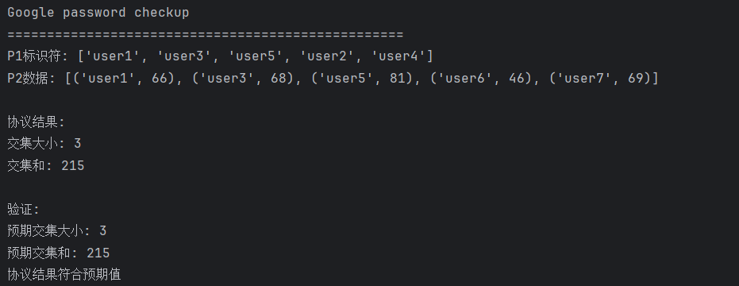

# Project-6-Google-Password-Checkup

## 概述
本报告详细介绍了Google Password Checkup协议的实现，该协议基于论文"Private Intersection-Sum-with-Cardinality"中的DDH协议。该协议允许两方（客户端和服务器）在不泄露各自输入的情况下，安全地计算双方标识符的交集大小以及交集中关联值的总和。

## 协议原理
### 符号定义
- $P1$ 拥有标识符集合 $V = {v_1, v_2, \dots, v_{m_1}}$

- $P2$ 拥有数据集合 $W = {(w_1, t_1), (w_2, t_2), \dots, (w_{m_2}, t_{m_2})}$，其中 $w_j$ 是标识符， $t_j$ 是关联的整数值

- $\mathbb{G}$ 为椭圆曲线群，生成元为 $G$，阶为素数 $q$

- $H: {0,1}^* \rightarrow \mathbb{G}$ 是将标识符映射到群元素的哈希函数

### 协议步骤
1. 初始化：

   - $P_1$ 随机选择 $k_1 \in \mathbb{Z}_q$
   - $P_2$ 随机选择 $k_2 \in \mathbb{Z}_q$，并生成 Paillier 同态加密密钥对 $(pk, sk)$

2. 第 1 轮（P₁ → P₂）：

   - $P_1$ 计算 $A_i = H(v_i)^{k_1}$ 并**打乱顺序**发送给 $P_2$

3. 第 2 轮（P₂ → P₁）：

   $P_2$ 计算以下内容：

   - $B_j = H(w_j)^{k_2}$
   - $C_j = \text{Enc}_{pk}(t_j)$（对每个 $t_j$ 进行 Paillier 加密）
   - $D_i = A_i^{k_2}$（对收到的每个 $A_i$ 进行运算）

   然后：

   - 打乱 $(B_j, C_j)$ 对，并打乱 $D_i$ 集合然后将它们全部发送给 $P_1$

4. 第 3 轮（P₁ → P₂）：

   - $P_1$ 计算 $E_j = B_j^{k_1}$
   - 将 $E_j$ 与 $D_i$ 匹配，找出交集（即满足 $E_j = D_i$ 的项）

   对于匹配项：

   - $P_1$ 使用 Paillier 同态加法，将对应的 $C_j$ 相加，得到： $Enc_{pk}$（ $\sum t_j$）

   - 并将该密文发送给 $P_2$

5. 输出结果：

   - $P_2$ 解密得到交集和 $\sum t_j$ 并告知 $P_1$ 交集大小（由匹配数量确定）
   - $P_1$ 和 $P_2$ 均获得交集大小， $P_2$ 获得交集和的明文

### 安全性分析

1. 协议基于 **DDH 假设**：

   > 在群 $\mathbb{G}$ 中，给定 $(G, G^a, G^b, G^{ab})$ 与 $(G, G^a, G^b, G^c)$ 是计算不可区分的（其中 $c \ne ab$）

2. 利用双重掩码保护标识符：

   - $P_1$ 使用 $k_1$， $P_2$ 使用 $k_2$
   - 只有同时知道 $k_1$ 和 $k_2$ 才能恢复 $H(v_i)^{k_1k_2}$，从而保护原始标识符隐私

3. 使用 Paillier 加密保护敏感值 $t_j$：

   - 加密后的 $C_j$ 不泄露 $t_j$ 的内容
   - 支持同态加法：可以在不解密的情况下对多个 $t_j$ 求和

## 代码实现
### 1. 椭圆曲线设置

使用 NIST P-256 曲线（`ecdsa.NIST256p`）：

```python
from ecdsa import NIST256p, ellipticcurve

class DDHPSIProtocol:
    def __init__(self):
        self.curve = NIST256p
        self.generator = self.curve.generator
        self.order = self.curve.order
        self.curve_params = self.curve.curve
```
### 2.哈希到点
将标识符映射到椭圆曲线上的点：
```python
    def hash_to_point(self, identifier: str) -> ellipticcurve.Point:
        """将标识符哈希到椭圆曲线上的点"""
        data = identifier.encode()
        digest = hashlib.sha256(data).digest()
        x = int.from_bytes(digest, 'big') % self.curve_params.p()

        # 求解 y^2 = x^3 + a*x + b
        for _ in range(3):  
            y_sq = (x**3 + self.curve_params.a() * x + self.curve_params.b()) % self.curve_params.p()
            y = pow(y_sq, (self.curve_params.p() + 1) // 4, self.curve_params.p())

            # 检查点是否在曲线上
            if (y * y) % self.curve_params.p() == y_sq:
                return ellipticcurve.Point(self.curve_params, x, y)

            # 如果不是二次剩余，尝试下一个x值
            x = (x + 1) % self.curve_params.p()
        return self.generator
```
### 3.客户端（P1）实现
P1 负责第 1 轮和第 3 轮的计算：
```python
class P1:
    """客户端实现"""
    def __init__(self, identifiers: List[str]):
        self.identifiers = identifiers
        self.psi_protocol = DDHPSIProtocol()
        self.k1 = random.randint(1, self.psi_protocol.order - 1)  # 客户端私钥
        self.intersection_size = 0  # 交集大小

    def round1(self) -> List[Tuple[int, int]]:
        """P1 第1轮: 计算并打乱 H(v_i)^k1"""
        points = []
        for v in self.identifiers:
            point = self.psi_protocol.hash_to_point(v)
            # 乘以k1: H(v_i)^k1
            encrypted_point = point * self.k1
            points.append((encrypted_point.x(), encrypted_point.y()))
        
        random.shuffle(points)
        return points

    def round3(
        self,
        b_points: List[Tuple[int, int]],
        c_points: List[Tuple[int, int]],
        encrypted_values: List[Any]
    ) -> Tuple[int, Any]:
        """P1 第3轮: 计算交集和同态求和"""
        curve = self.psi_protocol.curve_params

        b_points = [ellipticcurve.Point(curve, x, y) for x, y in b_points]
        c_points = [ellipticcurve.Point(curve, x, y) for x, y in c_points]

        e_points = [point * self.k1 for point in b_points]
        c_set = {(p.x(), p.y()) for p in c_points}

        matching_indices = [
            idx for idx, e_point in enumerate(e_points)
            if (e_point.x(), e_point.y()) in c_set
        ]

        self.intersection_size = len(matching_indices)

        if not encrypted_values or not matching_indices:
            public_key = encrypted_values[0].public_key if encrypted_values else None
            return self.intersection_size, public_key.encrypt(0) if public_key else None

        sum_ciphertext = encrypted_values[matching_indices[0]]
        for idx in matching_indices[1:]:
            sum_ciphertext += encrypted_values[idx]

        return self.intersection_size, sum_ciphertext
```
### 4. 服务器端（P2）实现
P2 负责第 2 轮的计算和最终解密：
```python
class P2:
    """服务器端实现"""
    def __init__(self, identifier_values: List[Tuple[str, int]]):
        self.identifier_values = identifier_values
        self.psi_protocol = DDHPSIProtocol()
        self.k2 = random.randint(1, self.psi_protocol.order - 1)  # 服务器私钥
        self.paillier_public_key, self.paillier_private_key = paillier.generate_paillier_keypair()

    def round2(self, a_points: List[Tuple[int, int]]) -> Tuple[
        List[Tuple[int, int]],
        List[Tuple[int, int]],
        List[Any]
    ]:
        """P2 第2轮: 计算并打乱响应"""
        curve = self.psi_protocol.curve_params
        a_points = [ellipticcurve.Point(curve, x, y) for x, y in a_points]

        b_points = []
        encrypted_values = []
        for w, t in self.identifier_values:
            point = self.psi_protocol.hash_to_point(w)
            encrypted_point = point * self.k2
            b_points.append((encrypted_point.x(), encrypted_point.y()))
            encrypted_values.append(self.paillier_public_key.encrypt(t))

        c_points = [point * self.k2 for point in a_points]
        c_points = [(p.x(), p.y()) for p in c_points]

        combined = list(zip(b_points, encrypted_values))
        random.shuffle(combined)
        b_points_shuffled, encrypted_values_shuffled = zip(*combined)

        random.shuffle(c_points)

        return list(b_points_shuffled), c_points, list(encrypted_values_shuffled)

    def decrypt_sum(self, sum_ciphertext) -> int:
        """解密同态和"""
        return self.paillier_private_key.decrypt(sum_ciphertext) if sum_ciphertext else 0
```
### 5. 协议执行
完整的 PSI 协议流程：
```python
def simulate_protocol(
    p1_identifiers: List[str],
    p2_data: List[Tuple[str, int]]
) -> Tuple[int, int]:
    """模拟完整协议执行"""
    p1 = P1(p1_identifiers)  # 客户端
    p2 = P2(p2_data)         # 服务器

    a_points = p1.round1()                                         # 第1轮: P1 -> P2
    b_points, c_points, encrypted_values = p2.round2(a_points)     # 第2轮: P2 -> P1
    intersection_size, sum_ciphertext = p1.round3(b_points, c_points, encrypted_values)     # 第3轮: P1 -> P2
    intersection_sum = p2.decrypt_sum(sum_ciphertext)              # P2解密求和结果

    return intersection_size, intersection_sum
```
## 测试与实验结果

### 1. 测试数据

- 客户端（P1）标识符：  
  `['user1', 'user3', 'user5', 'user2', 'user4']`

- 服务器（P2）数据：  
  `[('user1', n1), ('user3', n2), ('user5', n5), ('user6', n6), ('user7', n7)]`

### 2. 预期结果

- 交集标识符： `user1`, `user3`, `user5`

- 交集大小：  `3`

- 交集和： `n1+n3+n5`
### 3.实验结果
如图所示，实验结果与预期一致，我们成功完成了Google Password Checkup协议的核心功能：

