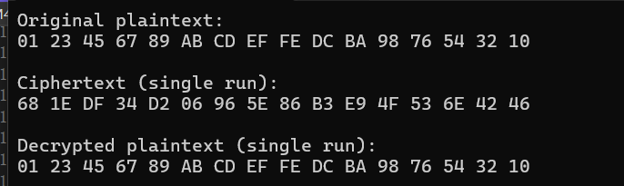

**SM4 软件实现 — 第2版**

## 概述

本项目为 SM4 分组密码算法的 **基础软件实现**，旨在完成算法的端到端加解密功能并进行性能测试。本版本为第1版（Baseline），目的是实现基础的加解密功能并在此基础上进行循环展开进行优化。

## 版本历史

- Version 1.0  
  基线版：功能完整的 SM4 加解密实现 & 性能测试。

- Version 1.1 — 第一阶段优化（展开宏优化） 
  在 1.0 基线上，使用宏将密钥扩展和轮函数完全展开，消除循环分支开销，提高流水线效率。


## 运行环境

* **操作系统**：Windows 11 (64-bit)
* **编译器**：Visual Studio 2022
* **处理器**：11th Gen Intel(R) Core™ i7-11800H @ 2.30GHz  
* **内存**：16.0 GB (15.7 GB 可用)  
* **系统类型**：64 位操作系统，基于 x64 的处理器  
## 本阶段优化（版本 1.1）

在第 1 版的基础上，完成了 **完全展开宏优化**：

---

### 1. 密钥扩展宏展开

使用 `#define KEY_EXPANSION(iter)` 宏，将 32 轮子密钥扩展展开为一系列独立调用，消除循环控制开销。

```cpp
#define KEY_EXPANSION(iter)                                      \
    tmp = k[1] ^ k[2] ^ k[3] ^ CK[iter];                          \
    tmp = (SBox[tmp >> 24] << 24) |                               \
          (SBox[(tmp >> 16) & 0xFF] << 16) |                      \
          (SBox[(tmp >> 8) & 0xFF] << 8) |                        \
          SBox[tmp & 0xFF];                                      \
    round_keys[iter] = k[0] ^ tmp ^ RotateLeft(tmp,13) ^ RotateLeft(tmp,23); \
    k[0] = k[1]; k[1] = k[2]; k[2] = k[3]; k[3] = round_keys[iter];

// 展开所有 32 次
KEY_EXPANSION(0); KEY_EXPANSION(1); … KEY_EXPANSION(31);
```

### 2. 轮函数宏展开

使用 `#define ROUND(iter)` 宏，将 32 轮加密/解密流程完全展开，提升流水线效率
```cpp
#define ROUND(iter)                                                        \
    uint32_t rk = decrypt ? round_keys[31 - (iter)] : round_keys[iter];   \
    uint32_t tmp = state[1] ^ state[2] ^ state[3] ^ rk;                    \
    tmp = (SBox[tmp >> 24] << 24) |                                        \
          (SBox[(tmp >> 16) & 0xFF] << 16) |                               \
          (SBox[(tmp >> 8) & 0xFF] << 8) |                                 \
          SBox[tmp & 0xFF];                                               \
    tmp ^= RotateLeft(tmp, 2) ^ RotateLeft(tmp, 10) ^                     \
           RotateLeft(tmp, 18) ^ RotateLeft(tmp, 24);                     \
    uint32_t new_state = state[0] ^ tmp;                                  \
    state[0] = state[1];                                                  \
    state[1] = state[2];                                                  \
    state[2] = state[3];                                                  \
    state[3] = new_state;

// 展开所有 32 轮
ROUND(0); ROUND(1); … ROUND(31);

```
## 示例输出



## 性能基线

* 本版本实现一个简单的SM4加解密功能，并进行了循环展开，接下来将做SIMD，AES-NI 等优化。


