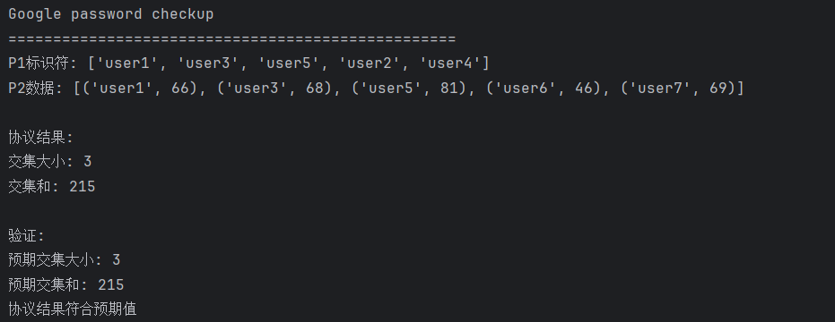

# **SM4 软件实现 — 最终版**

## 概述

本项目为 SM4 分组密码算法的 **软件实现**，旨在完成算法的端到端加解密功能并进行性能测试。目的是实现基础的加解密功能并在此基础上进行优化。

本项目两个子任务全部完成：

a): 从基本实现出发 优化SM4的软件执行效率，覆盖T-table、AESNI以及SIMD指令集等等;**（见文件SM4.cpp）**

b): 基于SM4的实现，做SM4-GCM工作模式的软件优化实现;**（见文件SM4-GCM.cpp）**

## 运行环境

* **操作系统**：Windows 11 (64-bit)
* **编译器**：Visual Studio 2022
* **处理器**：11th Gen Intel(R) Core™ i7-11800H @ 2.30GHz  
* **内存**：16.0 GB (15.7 GB 可用)  
* **系统类型**：64 位操作系统，基于 x64 的处理器

## 优化说明
### SM4的软件实现（SM4.cpp）
由于T 表 已经将 SBox + 线性变换 L() 的结果提前合并。而AES-NI（如 `_mm_aesenclast_si128`）用于运行时执行 SBox + AES 变换。**两者功能重叠，组合无意义**。

**所以我们在该代码中分化出两种优化路径，并同时实现，同时提供良好的接口可供选择：**
- **优化路径1：T表+SIMD指令（SSE/AVX，GFNI、VPROLD等）+宏展开+字节重排+指令并行+矩阵混合优化+数据对齐**
- **优化路径2：AES-NI+SIMD指令（SSE/AVX，GFNI、VPROLD等）+宏展开+字节重排+指令并行+矩阵混合优化+数据对齐**
### SM4-GCM工作模式的软件优化实现（SM4-GCM.cpp）
我们该工作模式的实现就是基于我们先前实现的SM4，包含其中的所有优化。
## 优化总结

本项目对 SM4 实现进行了多层次优化，提升了加解密性能，具体优化点如下：

- 使用宏展开替代轮函数循环，减少分支开销，密钥扩展过程完全展开，避免循环结构；
- 采用 SIMD指令级（如SSE/AVX，GFNI、VPROLD等）；
- 使用T-table，使用预计算的 T 表代替动态 SBox 和线性变换运算，提高效率
- 使用 AES-NI 指令模拟 SM4 SBox 的非线性变换，结合仿射矩阵实现效果更优的查表替代；
- 利用 `_mm_shuffle_epi8` 进行字节重排操作；
- 结合 AES 前后置矩阵变换与 SM4 专用矩阵混合线性变换；
- 使用 `_mm_loadu_si128` / `_mm_storeu_si128` 加快内存读取；
- 数据结构按128位对齐，减少内存对齐惩罚；
- 软件优化实现SM4-GCM工作模式


## ✨ 优化点详解

本实现融合了多种软件层面的高级优化技术，提升了运行速度和并行处理能力：

###  1. SIMD 并行优化（SSE/AVX，GFNI、VPROLD等指令集）

利用SIMD指令进行并行数据处理，实现异或、移位、S盒、线性变换等操作的向量化。


由于代码较长，运用较多，所以我们只放一小部分代码，详细代码见SM4.cpp文件

**代码示例：**
```cpp
#define CIRCULAR_SHIFT(val, bits) (((val) << (bits)) | ((val) >> (32 - (bits))))
#define VEC_ROTATE(vec, n) _mm_xor_si128(_mm_slli_epi32(vec, n), _mm_srli_epi32(vec, 32 - (n)))

#define VEC_XOR3(a, b, c) _mm_xor_si128(a, _mm_xor_si128(b, c))
#define VEC_XOR4(a, b, c, d) _mm_xor_si128(a, VEC_XOR3(b, c, d))
#define VEC_XOR5(a, b, c, d, e) _mm_xor_si128(a, VEC_XOR4(b, c, d, e))
#define VEC_XOR6(a, b, c, d, e, f) _mm_xor_si128(a, VEC_XOR5(b, c, d, e, f))
```
---
### 2.T-table提高查找效率
我们将 SBox + 线性变换 L 的结果提前计算好，按字节位存放。每次只需要查表和异或即可完成一轮的核心计算。
```cpp
static void InitTTable() {
        if (T_Table_Initialized) return;

        for (int i = 0; i < 256; i++) {
            // 将字节放入32位字的不同位置并应用线性变换
            uint32_t b0 = static_cast<uint32_t>(SBox[i]) << 24;
            uint32_t b1 = static_cast<uint32_t>(SBox[i]) << 16;
            uint32_t b2 = static_cast<uint32_t>(SBox[i]) << 8;
            uint32_t b3 = static_cast<uint32_t>(SBox[i]);

            // 应用线性变换 L(B) = B ⊕ (B <<< 2) ⊕ (B <<< 10) ⊕ (B <<< 18) ⊕ (B <<< 24)
            T[0][i] = b0 ^ CIRCULAR_SHIFT(b0, 2) ^ CIRCULAR_SHIFT(b0, 10) ^ CIRCULAR_SHIFT(b0, 18) ^ CIRCULAR_SHIFT(b0, 24);
            T[1][i] = b1 ^ CIRCULAR_SHIFT(b1, 2) ^ CIRCULAR_SHIFT(b1, 10) ^ CIRCULAR_SHIFT(b1, 18) ^ CIRCULAR_SHIFT(b1, 24);
            T[2][i] = b2 ^ CIRCULAR_SHIFT(b2, 2) ^ CIRCULAR_SHIFT(b2, 10) ^ CIRCULAR_SHIFT(b2, 18) ^ CIRCULAR_SHIFT(b2, 24);
            T[3][i] = b3 ^ CIRCULAR_SHIFT(b3, 2) ^ CIRCULAR_SHIFT(b3, 10) ^ CIRCULAR_SHIFT(b3, 18) ^ CIRCULAR_SHIFT(b3, 24);
        }

        T_Table_Initialized = true;
    }
```
###  3. AES-NI 加速 SBox 变换

我们借助了 **AES-NI 指令的非线性变换能力**，通过 `_mm_aesenclast_si128` 指令间接实现了高性能的 SBox 替换。这种方式**性能更优、并行度更强、安全性更高**，适合现代 x86 平台的高级优化。我们用 AES-NI 的 `_mm_aesenclast_si128` 指令模拟 SM4 SBox 的非线性变换，结合仿射矩阵实现效果更优的查表替代。

**关键代码：**
```cpp
inline __m128i TransformSBox(__m128i input) {
    input = _mm_shuffle_epi8(input, shuffle_mask);
    input = _mm_xor_si128(MatrixMul(input, AES_Forward_Matrix, AES_Reverse_Matrix),
                          _mm_set1_epi8(0x23));
    input = _mm_aesenclast_si128(input, _mm_setzero_si128());
    return _mm_xor_si128(MatrixMul(input, SM4_Forward_Matrix, SM4_Reverse_Matrix),
                         _mm_set1_epi8(0x3B));
}
```

---

### 4. 完全宏展开的轮函数与密钥扩展

使用宏展开替代 for 循环，使得 32 轮加解密和 32 次密钥扩展全被显式写出，减少分支，提高编译器优化能力。

**关键代码：**
```cpp
#define KEY_EXPANSION(iter) \
    tmp = k[1] ^ k[2] ^ k[3] ^ CK[iter]; \
    tmp = (SBox[tmp >> 24] << 24) | \
          (SBox[(tmp >> 16) & 0xFF] << 16) | \
          (SBox[(tmp >> 8) & 0xFF] << 8) | \
          SBox[tmp & 0xFF]; \
    round_keys[iter] = k[0] ^ tmp ^ CIRCULAR_SHIFT(tmp, 13) ^ CIRCULAR_SHIFT(tmp, 23); \
    k[0] = k[1]; k[1] = k[2]; k[2] = k[3]; k[3] = round_keys[iter]

...

KEY_EXPANSION(0);
KEY_EXPANSION(1);
...//此处省略    
KEY_EXPANSION(31);
```

---

### 5. 字节重排优化（Endian转换）

使用 `_mm_shuffle_epi8` 指令对数据进行重排，自动处理字节序问题，并辅助向量运算。

**关键代码：**
```cpp
const __m128i shuffle_vector = _mm_setr_epi8(
    3, 2, 1, 0, 7, 6, 5, 4, 11, 10, 9, 8, 15, 14, 13, 12);

state[i] = _mm_shuffle_epi8(state[i], shuffle_vector);
```

---

### 6. 仿射变换与矩阵乘法优化

仿照 AES 和 SM4 的 SBox 非线性结构，构造 8×8 矩阵并通过 `_mm_shuffle_epi8` 快速实现有限域 GF(2^8) 的仿射乘法。


**关键代码：**
```cpp
inline __m128i MatrixMul(__m128i x, __m128i upper, __m128i lower) {
    return _mm_xor_si128(
        _mm_shuffle_epi8(lower, _mm_and_si128(x, _mm_set1_epi32(0x0F0F0F0F))),
        _mm_shuffle_epi8(upper, _mm_and_si128(_mm_srli_epi16(x, 4), _mm_set1_epi32(0x0F0F0F0F)))
    );
}
```

---

### 7. 统一的加解密宏控制

通过宏控制解密轮密钥索引的方向，支持统一函数处理加密与解密操作，提升代码复用性。

**关键代码：**
```cpp
#define CIPHER_ROUND(iter, mode) \
    k_vec = _mm_set1_epi32((mode) ? round_keys[31 - (iter)] : round_keys[iter]); \
    ...
```
## SM4-GCM工作模式
SM4-GCM 模式结合了分组密码 SM4 和 GCM（Galois/Counter Mode）认证加密机制。GCM 模式利用计数器（Counter）模式进行数据加密，同时使用 GHASH 算法实现消息认证，确保数据的完整性和真实性。


1.SM4-GCM 模式中的加密过程可用如下公式表示：

$CT_i$ = $PT_i$ ⊕ $SM4_{Key}$ ($Cnt_i$),  i=1,2,...,n


其中：

- $\text{PT}_i$ 表示第 $i$ 个明文数据块，
- $\text{CT}_i$ 表示对应的密文数据块，
- $\text{Cnt}_i$ 是基于初始化向量（IV）和计数器生成的加密计数器，
- $\oplus$ 表示按位异或操作，
- $\text{SM4}_{\text{Key}}(\cdot)$ 表示使用密钥对输入块进行 SM4 加密。

2.GHASH 算法用于计算辅助认证数据（AAD）、密文和它们的长度的哈希值，其迭代计算公式为：

$$
Y_i = (Y_{i-1} \oplus \text{Data}_i) \otimes H, \quad i=1,2,\ldots,n
$$

其中：

- $Y_0 = 0^{128}$ 是初始的 128 位全零向量，
- $\text{Data}_i$ 是输入数据块，依次为 AAD 数据块、密文数据块、长度数据块（64 位 AAD 长度和 64 位密文长度拼接而成），
- $H = \text{SM4}_\text{Key}(0^{128})$ 是用密钥对全零块加密生成的哈希子密钥，
- $\oplus$ 表示按位异或，
- $\otimes$ 表示伽罗华域 GF $(2^{128})$ 的乘法。


3.最终认证码通过以下公式生成：

$$
\text{MAC} = Y_n \oplus \text{SM4}_\text{Key}(\text{IV} \;||\; 0^{31} \;||\; 1)
$$

其中：

- $Y_n$ 是 GHASH 处理完所有数据后的结果，
- $\text{IV}$ 是 12 字节（96 位）的初始化向量，
- $||$ 表示拼接操作，
- $0^{31}$ 是 31 位的零，
- $1$ 是计数器的起始值。

**由于代码过长，我们这里不再赘述，详细完整代码可见SM4-GCM.cpp**

---
## 代码测试


### SM4性能测试
测试函数如下，我们设置测试函数如下,可以测试两种优化路径，我们只需改变函数中的测试接口，如ProcessBlock_TTable对应路径1，ProcessBlock则对应路径2，修改一下即可：
- **优化路径1：T表+SIMD指令（SSE/AVX，GFNI、VPROLD等）+宏展开+字节重排+指令并行+矩阵混合优化+数据对齐**
- **优化路径2：AES-NI+SIMD指令（SSE/AVX，GFNI、VPROLD等）+宏展开+字节重排+指令并行+矩阵混合优化+数据对齐**
```cpp
void RunPerformanceTest(uint8_t* data, const uint32_t* round_keys,
    bool mode, const char* operation_name, int iterations = 10000) {
    uint8_t temp[16];
    memcpy(temp, data, 16);

    // 预热缓存
    for (int i = 0; i < 1000; i++) {
        SM4Cipher::ProcessBlock_TTable(temp, data, round_keys, mode);//这里选取T表+SIMD的优化路径，若想用AES-NI+SIMD，可以将ProcessBlock_TTable改为ProcessBlock
    }
    TimePoint start = std::chrono::steady_clock::now();
    for (int i = 0; i < iterations; i++) {
        SM4Cipher::ProcessBlock_TTable(temp, data, round_keys, mode);//这里选取T表+SIMD的优化路径，若想用AES-NI+SIMD，可以将ProcessBlock_TTable改为ProcessBlock
    }
    TimePoint end = std::chrono::steady_clock::now();

    auto duration = std::chrono::duration_cast<MicroSec>(end - start).count();
    printf("%s time: %.2f μs (avg over %d runs)\n",
        operation_name, duration / (double)iterations, iterations);
}
```
**优化前：**


**优化后：**


我们可以看到，经过优化后，SM4的性能提升巨大，达到硬件水准。
### SM4-GCM功能测试
测试代码如下，我们对其加解密及认证功能进行测试，并通过修改一位标签看是否还能解密成功，来判断认证功能是否有效。

共验证了 SM4-GCM 模式的三个核心特性：

- 加密正确性（密文能被正确解密回原文）。

- 数据完整性（解密前验证 tag）。

- 篡改检测（tag 被修改时解密失败）。

**测试代码：**
```cpp
void TestSM4_GCM() {
    // 测试向量 (符合NIST标准)
    uint8_t key[16] = {
        0x01, 0x23, 0x45, 0x67, 0x89, 0xAB, 0xCD, 0xEF,
        0xFE, 0xDC, 0xBA, 0x98, 0x76, 0x54, 0x32, 0x10 };

    uint8_t iv[12] = {
        0x01, 0x23, 0x45, 0x67, 0x89, 0xAB, 0xCD, 0xEF,
        0xFE, 0xDC, 0xBA, 0x98 };

    uint8_t aad[20] = {
        0x54, 0x68, 0x69, 0x73, 0x20, 0x69, 0x73, 0x20,
        0x61, 0x20, 0x74, 0x65, 0x73, 0x74, 0x20, 0x41,
        0x41, 0x44, 0x00, 0x00 };
    size_t aad_len = 18; // 实际使用的AAD长度

    uint8_t plaintext[64] = {
        0x53, 0x4D, 0x34, 0x2D, 0x47, 0x43, 0x4D, 0x20,
        0x54, 0x65, 0x73, 0x74, 0x20, 0x50, 0x6C, 0x61,
        0x69, 0x6E, 0x74, 0x65, 0x78, 0x74, 0x20, 0x44,
        0x61, 0x74, 0x61, 0x20, 0x66, 0x6F, 0x72, 0x20,
        0x53, 0x4D, 0x34, 0x2D, 0x47, 0x43, 0x4D, 0x20,
        0x4D, 0x6F, 0x64, 0x65, 0x20, 0x49, 0x6D, 0x70,
        0x6C, 0x65, 0x6D, 0x65, 0x6E, 0x74, 0x61, 0x74,
        0x69, 0x6F, 0x6E, 0x00, 0x00, 0x00, 0x00, 0x00 };
    size_t plaintext_len = 60;

    uint8_t ciphertext[64];
    uint8_t decrypted[64];
    uint8_t tag[16];

    // 初始化GCM
    SM4_GCM sm4_gcm(key);

    // 加密
    sm4_gcm.Encrypt(iv, aad, aad_len, plaintext, ciphertext, plaintext_len, tag);

    // 显示结果
    DisplayData("Original plaintext", plaintext, plaintext_len);
    DisplayData("Ciphertext", ciphertext, plaintext_len);
    DisplayData("Authentication Tag", tag, 16);

    // 解密
    bool success = sm4_gcm.Decrypt(iv, aad, aad_len, ciphertext, decrypted, plaintext_len, tag);

    if (success) {
        printf("Authentication successful!\n\n");
        DisplayData("Decrypted plaintext", decrypted, plaintext_len);

        // 验证解密是否正确
        if (memcmp(plaintext, decrypted, plaintext_len)) {
            printf("Decryption error: plaintext mismatch\n");
        }
        else {
            printf("Decryption verified: plaintext matches original\n");
        }
    }
    else {
        printf("Authentication failed!\n");
    }
    // 篡改测试
    printf("\nTesting tamper detection...\n");
    uint8_t tampered_tag[16];
    memcpy(tampered_tag, tag, 16);
    tampered_tag[0] ^= 0x01; // 修改标签

    bool tamper_success = sm4_gcm.Decrypt(iv, aad, aad_len,
        ciphertext, decrypted,
        plaintext_len, tampered_tag);
    if (tamper_success) {
        printf("ERROR: Tampered tag accepted!\n");
    }
    else {
        printf("Tampered tag correctly rejected\n");
    }

}
```

从图中我们可以看到，加解密功能正常，满足加解密一致性，且生成了认证标签（Authentication Tag）确保了密文和 AAD 的完整性与真实性，并能成功进行认证，同时进行篡改标签后，可以被成功检测：


