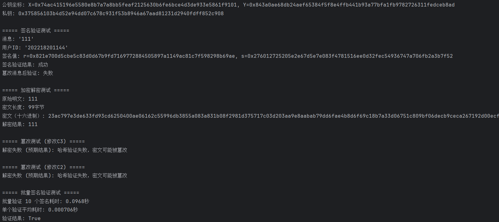

# SM2 算法的实现与优化
## 概述

本项目基于中国商用密码标准 SM2 椭圆曲线公钥密码算法，实现了完整的密钥生成、数字签名、签名验证、加密和解密功能。通过多种优化技术提升了算法效率，同时保证了安全性和正确性。以下文档详细说明了算法原理、优化思路、数学推导及具体实现。

---

## 算法原理与数学基础

### SM2 椭圆曲线参数

SM2 使用特定的椭圆曲线参数，定义在有限域 $\mathbb{F}_p$ 上：

- 椭圆曲线方程： $y^2 = x^3 + ax + b \mod p$
- 素数 $p$：
8542D69E4C044F18E8B92435BF6FF7DE457283915C45517D722EDB8B08F1DFC3

- 系数 $a$：
787968B4FA32C3FD2417842E73BBFEFF2F3C848B6831D7E0EC65228B3937E498

- 系数 $b$：
63E4C6D3B23B0C849CF84241484BFE48F61D59A5B16BA06E6E12D1DA27C5249A

- 基点 $G = (x, y)$：
x = 421DEBD61B62EAB6746434EBC3CC315E32220B3BADD50BDC4C4E6C147FEDD43D
y = 0680512BCBB42C07D47349D2153B70C4E5D7FDFCBFA36EA1A85841B9E46E09A2

- 基点阶 $n$：
8542D69E4C044F18E8B92435BF6FF7DD297720630485628D5AE74EE7C32E79B7

---

## 椭圆曲线点运算

### 点加法

给定点 $P = (x_1, y_1)$ 和 $Q = (x_2, y_2)$：

- 若 $P \neq Q$：

$$
\lambda = \frac{y_2 - y_1}{x_2 - x_1} \mod p \\
x_3 = \lambda^2 - x_1 - x_2 \mod p \\
y_3 = \lambda(x_1 - x_3) - y_1 \mod p
$$

- 若 $P = Q$：

$$
\lambda = \frac{3x_1^2 + a}{2y_1} \mod p
$$
```python
def ec_point_add(pt1, pt2):
  """椭圆曲线点加法"""
  if pt1 == (0, 0):
      return pt2
  if pt2 == (0, 0):
      return pt1

  x1, y1 = pt1
  x2, y2 = pt2

  if x1 == x2:
      if y1 == y2:
          slope = (3 * x1 * x1 + ECC_A) * mod_inv(2 * y1, FIELD_PRIME)
      else:
          return (0, 0)
  else:
      slope = (y2 - y1) * mod_inv(x2 - x1, FIELD_PRIME)

  slope %= FIELD_PRIME
  x3 = (slope * slope - x1 - x2) % FIELD_PRIME
  y3 = (slope * (x1 - x3) - y1) % FIELD_PRIME
  return (x3, y3)
```
### 点乘（标量乘法）
使用 double-and-add 算法高效计算 $k \cdot P$：
```python
def ec_point_mult(scalar, point):
    """标量点乘 (高效double-and-add算法)"""
    if scalar == 0 or scalar >= GROUP_ORDER:
        raise ValueError("无效的标量值")

    result = (0, 0)
    addend = point

    while scalar:
        if scalar & 1:
            result = ec_point_add(result, addend)
        addend = ec_point_add(addend, addend)
        scalar >>= 1

    return result
```
## SM2 数字签名算法

### 签名生成流程

1. 计算用户标识哈希 $Z_A$
2. 连接消息： $M = Z_A || \text{message}$
3. 哈希： $e = H_v(M)$
4. 生成随机数 $k$
5. 临时点 $k \cdot G = (x_1, y_1)$
6. 计算 $r = (e + x_1) \mod n$
7. 计算 $s = ((1 + d_A)^{-1} \cdot (k - r \cdot d_A)) \mod n$

```python
def generate_signature(private_key, message, user_id, public_key):
    """生成SM2签名 (RFC6979风格随机数生成)"""
    za = compute_user_hash(user_id, public_key[0], public_key[1])
    msg_full = za + message
    msg_bytes = msg_full.encode('utf-8')
    
    hash_value = sm3.sm3_hash(func.bytes_to_list(msg_bytes))
    e_value = int(hash_value, 16)
    
    k_seed = str(private_key) + message + str(time.time_ns())
    k_value = int(sha256(k_seed.encode()).hexdigest(), 16) % GROUP_ORDER

    temp_point = ec_point_mult(k_value, BASE_POINT)
    x_temp = temp_point[0]
    
    r_value = (e_value + x_temp) % GROUP_ORDER
    if r_value == 0 or r_value + k_value == GROUP_ORDER:
        return None

    s_value = mod_inv(1 + private_key, GROUP_ORDER)
    s_value = s_value * (k_value - r_value * private_key) % GROUP_ORDER

    return (r_value, s_value)
```
### 签名验证流程
1.计算 $t = (r + s) \mod n$

2.计算 $s \cdot G + t \cdot P_A = (x_1, y_1)$

3.计算 $R = (e + x_1) \mod n$

4.验证 $R == r$
```python
def verify_signature(public_key, message, user_id, signature):
    """验证SM2签名"""
    # ...计算过程...

    return constant_time_compare(r_value.to_bytes(32, 'big'), R_calculated.to_bytes(32, 'big'))
```
## SM2 加密解密算法
### 加密
1. 生成随机数 $k \in [1, n-1]$

2. $C_1 = k \cdot G = (x_1, y_1)$

3. $(x_2, y_2) = k \cdot P_B$

4. $t = KDF(x_2 \parallel y_2, \text{明文长度})$

5. $C_2 = \text{明文} \oplus t$

6. $C_3 = Hash(x_2 \parallel \text{明文} \parallel y_2)$

7. 输出密文 $C = C_1 \parallel C_3 \parallel C_2$
```python
def sm2_encrypt(public_key, plaintext):
    """SM2加密算法"""
    if public_key == (0, 0):
        raise ValueError("公钥无效 (无穷远点)")
    k = secrets.randbelow(n - 1) + 1

    C1_point = ec_point_mult(k, G)
    C1_x, C1_y = C1_point

    kPb_point = ec_point_mult(k, public_key)
    x2, y2 = kPb_point
    x2_bytes = x2.to_bytes(32, 'big')
    y2_bytes = y2.to_bytes(32, 'big')

    t = kdf(x2_bytes + y2_bytes, len(plaintext) * 8)
    if all(b == 0 for b in t):
        raise ValueError("KDF输出全零，需要重新加密")

    C2 = bytes(a ^ b for a, b in zip(plaintext, t))

    input_C3 = x2_bytes + plaintext + y2_bytes
    hash_list = func.bytes_to_list(input_C3)
    C3 = bytes.fromhex(sm3.sm3_hash(hash_list))

    C1_bytes = C1_x.to_bytes(32, 'big') + C1_y.to_bytes(32, 'big')
    return C1_bytes + C3 + C2
```
### 解密
解密是加密的逆过程，包含对密文完整性的验证。

## 优化措施
### 1. 预计算缓存
对重复计算的结果进行缓存，减少计算开销：
```python
# 优化: 预计算缓存
ZA_CACHE = {}
POINT_ADD_CACHE = {}
MOD_INV_CACHE = {}

@functools.lru_cache(maxsize=128)
def compute_user_hash(user_id, pub_x, pub_y):
    """计算用户标识哈希ZA (带缓存)"""
    cache_key = (user_id, pub_x, pub_y)
    if cache_key in ZA_CACHE:
        return ZA_CACHE[cache_key]
    
    # ...计算过程...
    
    ZA_CACHE[cache_key] = result
    return result
```
### 2.点压缩技术
减少公钥存储空间，提高传输效率：
```python
def compress_point(point):
    """压缩椭圆曲线点"""
    x, y = point
    prefix = 0x02 if y % 2 == 0 else 0x03
    return prefix.to_bytes(1, 'big') + x.to_bytes(32, 'big')

def decompress_point(compressed):
    """解压缩椭圆曲线点"""
    prefix = compressed[0]
    x = int.from_bytes(compressed[1:], 'big')
    y_sq = (x*x*x + ECC_A*x + ECC_B) % FIELD_PRIME
    y = pow(y_sq, (FIELD_PRIME + 1) // 4, FIELD_PRIME)
    
    if prefix == 0x02:
        return (x, y if y % 2 == 0 else FIELD_PRIME - y)
    else:
        return (x, y if y % 2 == 1 else FIELD_PRIME - y)
```
### 3.多线程并行签名验证
行处理签名验证：
```python
def batch_verify_signatures(public_key, messages, user_ids, signatures):
    """批量验证SM2签名"""
    with ThreadPoolExecutor() as executor:
        params = [(public_key, msg, uid, sig) for msg, uid, sig in zip(messages, user_ids, signatures)]
        results = list(executor.map(lambda p: verify_signature(*p), params))
    return results
```
### 4. 常数时间操作
防止时序攻击，保护密钥安全：
```python
def constant_time_compare(a, b):
    """常数时间比较，防止时序攻击"""
    if len(a) != len(b):
        return False
    
    result = 0
    for x, y in zip(a, b):
        result |= x ^ y
    return result == 0
```
## 功能测试
我们从图中可以看到：
- 1.成功生成了公私钥对
- 2.签名功能验证通过
- 3.可以成功检测出消息篡改（如图中，消息篡改后验证失败）
- 4.加解密测试通过，满足加解密一致性
- 5.篡改测试通过，消息篡改后，哈希验证失败，可知消息被篡改
- 6.签名并行验证成功，效率极高


